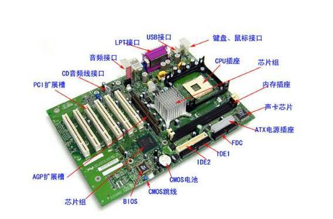

# 学习编程从认识计算机开始  #

----------

> 注意： 本文主要写给零基础的同学，作为编程入门引导, 如有不当之处，还请指正。

----------

## 一、 什么是计算机？ ##

计算机由两部分组成：  硬件系统（hardware system）和软件系统（software system）。

## 1. 计算机的直观理解 ##

一般常用的计算机主要有台式机和笔记本电脑，两者体型可能相差巨大，但是其硬件系统的组成结构都是一样的，计算机就是由一堆电子零件拼装起来的，在开机之前，你能看到的和拆下的所有零件，都属于硬件系统。 

软件系统就是你开机之后，透过屏幕能看到的和能操作的所有东西，通常接触到的软件主要有操作系统和应用程序这么两类，常用的操作系统有微软的Windows系统或Linux系统，或者苹果公司的MAC系统，那么开机之后和你交互的就是对应操作系统提供的操作界面，在计算机上使用的应用程序，一般有Office系列办公软件、各种浏览器程序、玩的各种游戏应用如魔兽、LOL、吃鸡（绝地求生）等、视频/音频/图片播放器等等...。

注意：  所有的应用程序都是安装在操作系统之上的，不同的操作系统都可以运行为该系统开发的应用程序，而特定系统上发布的应用程序一般不能在其他系统上运行，如Windows上的以exe结尾的应用程序不能在Mac和Linux上运行。

## 2. 硬件系统核心组成部分介绍 ##

硬件系统主要由5个核心部分组成：  运算器，控制器，存储器，输入设备和输出设备。 

1. **运算器和控制器都集成在处理器CPU里面**，CPU即中央处理器，是一台计算机的运算核心和控制核心。其功能主要是解释计算机指令以及处理计算机软件中的数据。运算器主要能进行加、减、乘、除等数学运算，也能作比较、判断、查找、逻辑运算等，控制器是计算机指挥和控制其它各部分工作的中心，其工作过程和人的大脑指挥和控制人的各器官一样。
	CPU由运算器、控制器、寄存器、高速缓存及实现它们之间联系的数据、控制及状态的总线构成。作为整个系统的核心，CPU也是整个系统最高的执行单元，因此CPU已成为决定电脑性能的核心部件，大多都以它为标准来判断电脑的档次。

2. **存储器通常指的是内存储器**，主要包括随机存取存储器RAM和只读存储器ROM，RAM主要指的是内存条，RAM是动态随机存取储器，它的特点是数据读写快，掉电失忆，并且再也无法恢复； ROM主要应用于主板上的BIOS，制造ROM的时候，信息（数据或程序）就被存入并永久保存，并且不能够进行修改。 

	与内存储器相对应的是外存储器，外存通常是磁性介质或光盘，像硬盘，U盘，移动硬盘，磁带，CD等，能长期保存信息，并且不依赖于电来保存信息，但是其速度与内存相比非常且价格较内存相比非常低廉，注意： 外部存储器既不是RAM也不是ROM。

3. **输入设备**，负责将数据、程序、文字符号、图象、声音等信息输送到计算机中，常用的输入设备有键盘、鼠标、触摸屏、数字转换器、摄像头等。

4. **输出设备**，负责将计算机的运算结果或者中间结果打印或显示出来，常用的输出设备有：显示器、打印机、绘图仪和传真机等。

## 3. 硬件系统其他组成部分介绍 ##

**主板**： 主板把电脑的各个部件紧密连接在一起，各个部件通过主板进行数据传输。也就是说，电脑中重要的“交通枢纽”都在主板上，它工作的稳定性影响着整机工作的稳定性，在整合型主板中常把声卡、显卡、网卡部分或全部集成在主板上。

**显卡**： 显卡在工作时与显示器配合输出图形、文字，作用是将计算机系统所需要的显示信息进行转换驱动，并向显示器提供行扫描信号，控制显示器的正确显示，是连接显示器和个人电脑主板的重要元件，显卡分为核芯显卡、集成显卡和独立显卡。

核芯显卡是Intel产品新一代图形处理核心，和以往的显卡设计不同，Intel凭借其在处理器制程上的先进工艺以及新的架构设计，将图形核心与处理核心整合在同一块基板上，构成一颗完整的处理器，优点低功耗、高性能。

集成显卡是将显示芯片、显存及其相关电路都集成在主板上，与其融为一体的元件；集成显卡的显示芯片有单独的，但大部分都集成在主板的北桥芯片中，优点： 功耗低、发热量小，缺点：性能相对略低。

独立显卡是指将显示芯片、显存及其相关电路单独做在一块电路板上，自成一体而作为一块独立的板卡存在，它需占用主板的扩展插槽（ISA、PCI、AGP或PCI-E)，优点：单独安装有显存，一般不占用系统内存，缺点：系统功耗有所加大，发热量也较大。

**声卡**： 声卡是组成多媒体电脑必不可少的一个硬件设备，其作用是当发出播放命令后，声卡将电脑中的声音数字信号转换成模拟信号送到音箱上发出声音。

**网卡**： 网卡的作用是充当电脑与网线之间的桥梁，它是用来建立局域网并连接到Internet的重要设备之一。

**电源**： 给计算机所有组成部分供电，是将220V交流电转换为其它硬件使用的5V、12V、3.3V直流电，其性能的好坏，直接影响到其他设备工作的稳定性，进而会影响整机的稳定性，笔记本电脑通过自带可充电锂电池，为计算机提供有效电源，如果电池坏了或者卸了，连接上充电器也可以供电运行。

## 4. 计算机系统的工作原理介绍 ##

输入设备接受外界信息，也就是原始数据，控制器发出指令将数据送入存储器，然后向存储器发出取指令命令，在取指令命令下，程序指令逐条送入控制器，控制器对指令进行译码，并根据指令的操作要求，向存储器和运算器发出存数、取数命令和运算命令，经过运算器并把计算结果存储在存储器内。最后在控制器发出的取数和输出命令的作用下，通过输出设备输出计算结果。

程序与数据一样进行存贮，按程序编排的顺序，一步一步地取出指令，自动地完成指令规定的操作是计算机最基本的工作原理。这一原理最初是由美籍匈牙利数学家冯.诺依曼于1945年提出来的，故称为冯.诺依曼原理。

## 5. 工作原理比喻 ##

如果把完整计算机硬件系统比喻成一个人，那么CPU（运算器和控制器）就是大脑的思维，而存储器（RAM、ROM、硬盘）就是人的记忆细胞，主板就是人的骨架内脏等，电源就是人的血液，输入设备就是人的触觉、视觉、听觉、味觉和嗅觉等，输出设备就是人的嘴巴，而软件系统就是人的各种神经系统。

人通过触觉、视觉、听觉、味觉和嗅觉等（输入设备）接受到外界的信息（看了一个视频），也就是原始数据，大脑的思维（控制器）控制着将捕获到的数据存入记忆细胞（存储器），在回忆（执行一个指令）刚刚接收到的信息（视频）时，大脑思维开始回忆（先取指令，再对指令译码），从记忆细胞中取出一幅图片数据（取数据），经过大脑思维（控制器和运算器）的译码运算，最终在脑海里还原出了视频一幕的景象（输出结果）。

## 参考 ##

[https://baike.baidu.com/item/%E6%98%BE%E5%8D%A1/133122](https://baike.baidu.com/item/%E6%98%BE%E5%8D%A1/133122 "显卡介绍")
[https://baike.baidu.com/item/%E8%AE%A1%E7%AE%97%E6%9C%BA%E5%B7%A5%E4%BD%9C%E5%8E%9F%E7%90%86/7681289?fr=aladdin](https://baike.baidu.com/item/%E8%AE%A1%E7%AE%97%E6%9C%BA%E5%B7%A5%E4%BD%9C%E5%8E%9F%E7%90%86/7681289?fr=aladdin "计算机工作原理")

