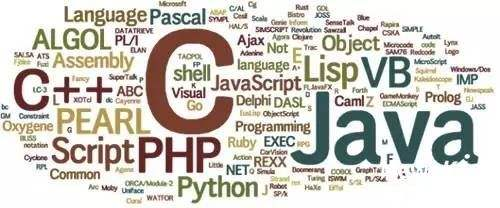

# 走进程序的世界——认识程序和编程语言 #

----------

> 注意： 本文主要写给零基础的同学，作为编程的入门引导, 如有不当之处，还请指正。

----------

回顾上一节，我们已经知道计算机的一些基本概念了，如硬件系统及其组成，操作系统和应用程序等，本小节主要想讲明白什么是程序，什么是程序语言，以及高级语言的一些特点。

## 一、 什么是计算机程序？ ##

摘一段百科上的描述： 计算机程序（Computer program），也称为软件（software），简称程序（Program），是指一组指示计算机或其他具有信息处理能力装置每一步动作的指令，通常用某种程序设计语言编写，运行于某种目标体系结构上。

## 通俗的理解计算机程序 ##

计算机程序，就是运行在计算机上能完成特定功能的指令集合，计算机程序的复杂程度由所需完成的逻辑功能来决定，计算机程序有简单的也有复杂的，如编写简单的程序可以计算一个一元二次方程方程的解，而一个功能强大的游戏程序，可以给你带来不一样的游戏体验，程序的本质就是运行在计算机之上的一组有序指令的集合，这些指令可以让计算机执行一些具体的运算，能实现特定的功能。

在计算机开机后，进入操作系统如Windows/Linux/Mac等，操作系统会加载并执行许多程序，操作系统本质也是由一组计算机程序组成的，通常意义上表述的计算机程序，一般指的是能完成某些特定功能，相对比较独立的程序，如视频/音频播放器，Web浏览器，社交工具的客户端Wechat/QQ等；而一般由许多计算机程序共同协作来完成比较复杂的任务的一系列程序，通常被称为系统，如操作系统等。

百科描述中所说的指令运行于某种目标体系结构上，对于绝大多数计算机来说，从计算机体系结构的大分类来看，这里的目标体系结构通常都是指最常见的冯诺依曼体系结构，也就是上一节所讲述计算机的基本结构，而在冯诺依曼体系结构设计之下，CPU（运算器和控制器）的设计也可以划分不同的体系结构。

再了解一下什么是指令集，指令集是存储在CPU内部，对CPU运算进行指导和优化的硬程序，也就是说CPU的运算器只能执行CPU的指令集体系所支持的指令，之所以出现不同的CPU架构，就是由于指令集的设计不同，常见的CPU架构有Intel公司的X86架构和ARM公司的ARM架构，对应的指令集分别为复杂指令集(CISC)和精简指令集(RISC)， X86和ARM处理器的主要区别就是，前者使用复杂指令集(CISC)，而后者使用精简指令集(RISC)。X86架构的CPU常见于笔记本、台式机和服务器上，而ARM架构的CPU多用于手机及嵌入式系统里，指令集的细分类型还有许多，感兴趣的可以具体了解一下。

## 二、 什么是程序语言？ ##

上面讲述了什么是计算机程序，计算机程序的本质就是运行在某种目标体系结构（可暂且理解为某种CPU架构）上面的指令集合，而这些指令的集合都应该能被该CPU架构所支持，即该CPU的运算器可以执行该指令集合中的所有指令，也就是说在不同的CPU架构上编写相同功能的程序，最后生成的该程序所对应的指令集合很可能是不一样的。

## 1. 机器语言 ##

通过CPU架构所支持的指令集可以编写出成千上万的程序，而由指令集所组成的程序，可以被CPU直接解读和执行， 由指令集生成程序的过程就如同，通过文字去编写文章，单个的字或词就是某一条具体的指令，不同字或词(指令)通过一定规则组合起来，就是一篇文章(程序)，所以CPU架构所支持的指令集的体系，也可以看做是一门语言，这门语言就是通常所说的机器语言，又称为机器码。不同的CPU架构所支持的不同指令集可以看做是不同的机器语言，就如同文字也分为汉语、English等许多语言，机器语言的道理也一样。

## 2. 汇编语言 ##

通过机器语言就可以编写出许多各种功能的程序了，但是用机器语言编写程序，编程人员要首先熟记所用计算机的全部指令代码和代码的涵义，手编程序时，程序员还需要自己处理每条指令和每一数据的存储分配和输入输出，还得记住编程过程中每步所使用的工作单元处在何种状态。这是一件十分繁琐的工作。编写程序花费的时间往往是实际运行时间的几十倍甚至几百倍，而且，编出的程序全是些0和1的指令代码，直观性差，还容易出错，那该怎么办了？

这时候汇编语言便产生了，汇编语言的主体是汇编指令。汇编指令和机器指令的差别在于指令的表示方法上，汇编指令是机器指令便于记忆的书写格式，如执行一个操作：寄存器BX的内容送到AX中(具体什么含义可以不用深究，明白是一条完成特定功能的指令即可)

	1000100111011000               机器指令
	mov ax,bx                    汇编指令

很容易可以看出，同样一个操作，下面的汇编指令更容易被人熟记，汇编语言的出现是程序发展的一大进步，相比机器语言主要有以下几个特点：

1. 更具有可编程性，即使用汇编语言，程序员可以更加简便、更加快速、更容易理解的方式完成同样的编程任务；

2. 程序可移植性，上文介绍过不同的CPU架构支持不同的指令集体系(机器语言)，所以通常以机器语言为某一类CPU架构编写的程序，不能运行在其它CPU架构之上，而有了汇编语言，可以想象同样一条汇编语句，运行在不同的CPU架构上时，只需要编译器把它编译(就如不同语言文字之间的翻译)成对应CPU架构所支持的机器码即可；

汇编语言的编译器，是可以把汇编语言翻译成目标CPU架构上机器语言的程序。

## 3. 高级语言 ##

前面我们了解了什么是机器语言和汇编语言，汇编语言也是和机器语言一样，都是直接对硬件进行操作，但是汇编语言指令采用了英文缩写的标识符，更容易识别和记忆，但也只是相对于机器语言而言的。在实际编程中，汇编语言源程序也是十分复杂和冗长的，为了更加简单和高效的编写程序，于是高级语言就应运而生了。

高级语言并不是指一种语言，而是包括很多编程语言，比如C、C++、Java、php、python等等，是高度封装的编程语言。高级语言与计算机的硬件结构和CPU架构(指令系统)无关，汇编语言已经具备一定的可移植性了，编译器可以根据相应的CPU架构翻译成对应的机器语言，同样高级语言的可移植性更强，编译器也可以将高级语言翻译成目标CPU架构上的机器语言，至于是否是直接翻译成机器语言，还是先经过汇编再翻译成机器语言，取决于编译器的实现。

如今我们一般不需要学会如何用机器语言，汇编语言来进行编程，我们最多知道能如何看懂汇编语言就可以了。我们所编写的高级语言，被翻译成目标语言时，编译器会自动进行一些优化的处理。

## 4. 高级语言的分类 ##

高级语言的分类方式很多，根据设计思想特点可以划分为面向过程型（命令式）语言、面向对象型语言、函数式语言和逻辑式语言，而根据代码在执行之前被翻译的时间，划分为两类： 解释型语言和编译型语言。

**面向过程型（命令式）语言**

这种语言的语义基础是模拟“数据存储/数据操作”的图灵机可计算模型，十分符合现代计算机体系结构的自然实现方式。其中产生操作的主要途径是依赖语句或命令产生的副作用。现代流行的大多数语言都是这一类型，比如 Fortran、Pascal、Cobol、C、C++、Basic、Ada、Java、C# 等，各种脚本语言也被看作是此种类型。

**面向对象语言**

现代语言中的大多数都提供面向对象的支持，但有些语言是直接建立在面向对象基本模型上的，语言的语法形式的语义就是基本对象操作。主流的支持面向对象的语言有 C++ 、Java、C#、PHP、Python等，一般的语言也都支持面向过程（命令式）的编程方式。

**函数式语言**

这种语言的语义基础是基于数学函数概念的值映射的λ算子可计算模型。这种语言非常适合于进行人工智能等工作的计算。典型的函数式语言如 Lisp、Haskell、ML、Scheme 、F#等。

**逻辑式语言**

这种语言的语义基础是基于一组已知规则的形式逻辑系统。这种语言主要用在专家系统的实现中，最著名的逻辑式语言是 Prolog。

虽然各种语言属于不同的类型，但它们各自都不同程度地对其他类型语言的运算模式都有所支持。

## 5. 解释型语言 ##

解释型语言又可以根据语言的主动和被动特点划分为： 标记语言和脚本语言。标记语言时被动的等待解释，不主动向计算机发出指令，脚本语言一般主动发出指令让计算机执行任务。

**标记语言**

标记语言，是一种将文本（Text）以及文本相关的其他信息结合起来，展现出关于文档结构和数据处理细节的电脑文字编码。与文本相关的其他信息（包括文本的结构和表示信息等）与原来的文本结合在一起，但是使用标记进行标识。

例如： xml, html,  xhtml

**脚本语言**

脚本语言是为了缩短传统的编写-编译-链接-运行（edit-compile-link-run）过程而创建的计算机编程语言。它的命名起源于一个脚本“screenplay”，每次运行都会使对话框逐字重复。早期的脚本语言经常被称为批量处理语言或工作控制语言。一个脚本通常是解释运行而非编译。脚本语言通常都有简单、易学、易用的特性，目的就是希望能让程序员快速完成程序的编写工作。

例如： JavaScript、VBScript、PHP、Python

## 6. 编译型语言 ##

编译型语言：程序在执行之前需要一个专门的编译过程，把程序编译成为机器语言的文件，运行时不需要重新翻译，直接使用编译的结果就行了。程序执行效率高，依赖编译器，跨平台性差些。

例如： C、C++、c#、java等

## 7. 不同类型高级语言的区别 ##

1. 标记语言不用于向计算机发出指令，常用于格式化和链接。 

2. 脚本语言介于标记语言和编程语言之间，脚本语言脚本语言不需要编译，可以直接用，由解释器来负责解释。 

3. 编译型语言写的程序执行之前，需要一个专门的编译过程，把程序编译成为机器语言的文件，比如exe文件，以后要运行的话就不用重新翻译了，直接使用编译的结果就行了（exe文件），因为翻译只做了一次，运行时不需要翻译，所以编译型语言的程序执行效率高。

## 8. 高级语言的一般性特点 ##

1. 高级语言接近算法语言，易学、易掌握，一般工程技术人员只要几周时间的培训就可以胜任程序员的工作；

2. 高级语言为程序员提供了结构化程序设计的环境和工具，使得设计出来的程序可读性好，可维护性强，可靠性高；

3. 高级语言远离机器语言，与计算机的硬件结构及指令系统无关，有更强的表达能力，因而所写出来的程序可移植性好，重用率高；

4. 由于把繁杂琐碎的事务交给了编译程序去做，所以自动化程度高，开发周期短，且程序员得到解脱，可以集中时间和精力去从事对于他们来说更为重要的创造性劳动，以提高程序的质量；

5. 高级语言编译生成的程序代码一般比用汇编程序语言设计的程序代码要长，执行的速度也慢。所以汇编语言适合编写一些对速度和代码长度要求高的程序和直接控制硬件的程序，高级语言程序“看不见”机器的硬件结构，不能用于编写直接访问机器硬件资源的系统软件或设备控制软件。为此，一些高级语言提供了与汇编语言之间的调用接口。用汇编语言编写的程序，可作为高级语言的一个外部过程或函数，利用堆栈来传递参数或参数的地址。