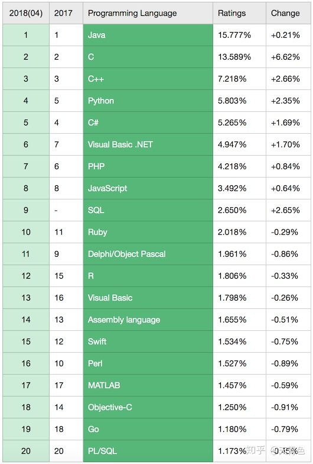
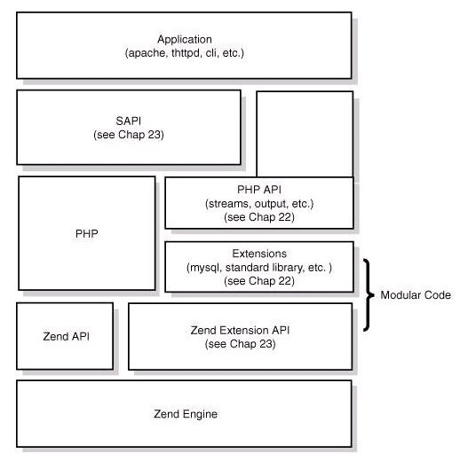
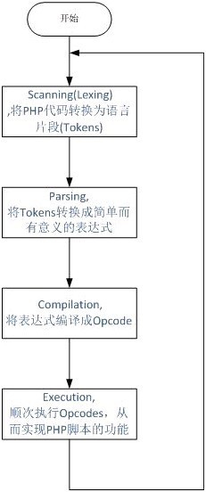

# 程序代码的编写和运行过程介绍 #

----------

> 注意： 本文主要写给零基础的同学，作为编程的入门引导, 如有不当之处，还请指正。

> [访问源站](http://www.araryun.com "访问源站")

>   [原创不易，未经允许，严禁转载](http://www.araryun.com "原创不易，转载请注明")

----------

回顾上一节，我们已经基本了解了计算机程序和程序语言的基础知识，本小节主要想讲讲程序源代码的编写，至程序运行的整个过程，仅限于大致流程的介绍，不深究太具体的细节，让初学者能建立起一个从程序的开发至运行的完整体系即可。

## 一、 如何编写一个计算机程序？ ##

上一节中，已经知道了计算机程序就是特定机器指令的集合，也了解了可以通过机器语言、汇编语言和高级语言来编写程序，其中汇编和高级语言编写的代码最终会被翻译成CPU可执行的机器指令集合。

编写程序简称编程，编程就是使用一种程序设计语言来编写程序代码，让计算机解决某些具体的问题或完成特定的功能，根据使用的程序设计语言的不同，编写出的程序就不同。

使用程序设计语言编写出的程序代码就叫做源代码，源代码经过编译器的翻译，最终生成可以在目标体系结构上运行的程序，该程序就叫做可执行（运行）程序，在Windows上面最常见的就是以.exe扩展名结尾的程序，而在Linux和Mac系统上，可执行程序一般都不添加任何扩展名，也可以添加任意扩展名，只需要给该程序文件赋予可执行的权限，就能运行起来了。

## 编写一个计算机程序要做以下三件事 ##

1. 选择一个程序开发和运行的平台（目标体系结构）。

普通的应用程序都是运行在操作系统之上的，因此需要先选定一个程序运行的环境，来运行你编写出的程序，通常就是在Windows、Linux或Mac操作系统中选着一个作为开发和运行环境。

程序的开发环境，通常包括用来编写和运行程序的操作系统，以及程序编辑器和编译工具等。程序的部署运行环境，通常是指希望编写出的程序部署的操作系统，以及程序运行所需的依赖等。通常开发环境即用来编写和调试程序代码，部署环境用来运行编译出的程序，这二者环境可以保持一致，如在Windows上开发，最后部署到Windows系统上，或者在Mac系统上开发并部署到Mac系统上。

由于现在的许多高级程序设计语言，具有很好的移植性，可以在一种操作系统上开发和调试程序，开发完成后部署至其它操作系统上去运行，如在Windows上开发的PHP或Python程序通常都可以很容易的移植到其它平台上。

至于程序的可移植性的大小，主要取决于所编写的程序和操作系统的耦合程度，即通过该编程语言调用了多少操作系统特有的功能，调用的越多则耦合程度越高，可移植性就越差。通常一些脚本语言由于很少提供与操作系统直接相关的接口，因此可移植性都比较好，而C和C++语言可直接调用操作系统提供的许多接口，当编写的程序使用了许多特有的函数接口时，其可移植性就会很差。

2. 选择一门高级程序语言

上一节了解了高级语言的分类，按运行流程大致可分为编译型和解释型语言，选择编译型语言，则需要经过先编写程序，编译程序，链接程序和执行程序这几个过程，只有当源代码经过编译和链接之后才能生成可执行程序，在对应的操作系统上运行。选择解释型语言，需要先编写代码，再使用该语言对应的解释器去解释和运行代码，解释型语言在调用程序之前不需要编译，在运行时由解释器来负责解释和执行指令。

对于初学者来说，建议先选择一门脚本语言来入门，如PHP，脚本语言简单，初学易上手，在掌握了一门脚本语言之后，再循序渐进，对编程有了一定的认识之后，再学习其他的编程语言，可以起到事半功倍的效果。

3. 学习程序语言的语法规则

所有的程序语言都有其相应的语法规则，掌握了一些基本语法规则之后就可以愉快的编程了，下面是一个PHP的程序，打印了"Hello,World!"：

	<?php
				echo  "Hello,World!"；
	?>

## 二、 几种高级语言应用场景介绍 ##

回忆编程语言的发展轨迹，从最原始的机器语言，衍生出了汇编语言，再进化到了高级语言，语言的进化得更加接近人类的自然语言 ，语言的可用性、可读性和可移植性也越来越强，每一门高级语言的出现都有着特定的背景，简单的功能应用角度介绍一下常见的几种语言的功能特点，以下是2018年4月语言使用率的排名：

C/C++语言: 因此运算效率高，从理论上来讲，C/C++语言几乎什么都能实现，但从开发成本和开发难度上来讲，很多情况下C/C++都不是最好的选择。由于比较贴近操作系统，C语言可以应用于系统底层开发、硬件驱动程序、其它高级语言的编译器等，C++可以应用用于桌面应用程序、大型应用系统或大型游戏开发，如Office办公软件、深度学习框架(TensorFlow、Caffe...)、Web服务器、LOL、魔兽世界等。C/C++也有很多不适合应用的场景，如常见的网站开发，使用一些脚本语言PHP、Python等，效率要高得多。

Java语言： 运行在Java虚拟机上，可移植非常好，只要能运行Java虚拟机的系统，都能运行你写的Java程序，Java适合做应用程序开发，如桌面应用程序、Android APP程序、网站后台开发等等。

PHP语言：  PHP是一门开源的脚本语言，简洁、高效，主要应用于Web开发，以开发效率闻名，可移植性也非常好。

Python语言： 脚本语言，应用场景比PHP要广泛许多，可以做Web开发、网络程序、科学计算、数据分析、文本图像处理、人工智能领域等

## 三、 编译型语言编译、链接和运行的过程 ##

上述的C/C++语言属于编译型语言，下面主要讲述一下C语言如何从编写的源代码，经过编译，链接，再到执行的过程。

C语言的编译链接过程要把我们编写的一个c程序（源代码）转换成可以在硬件上运行的程序（可执行代码），需要进行编译和链接，编译就是把文本形式源代码翻译为机器语言形式的目标文件的过程。链接是把目标文件、操作系统的启动代码和用到的库文件进行组织形成最终生成可加载、可执行代码的过程。

编译的操作是由C语言编译器完成的，链接的操作是由C语言链接器完成的，编译器和链接器的本质都是一个可执行程序，编译器和链接器也有许多的种类，只要能够实现把C源代码翻译为机器语言的程序都可以称为一个C语言的编译器（如gcc）。

## 3.1 编译过程 ##

编译过程又可以分成两个阶段：编译和汇编

**编译**

编译是指编译器读取源程序（字符流），对之进行词法和语法的分析，将高级语言指令转换为功能等效的汇编代码。源文件的编译过程包含两个主要阶段：

1. 预处理阶段，在正式的编译阶段之前进行。预处理阶段将根据已放置在文件中的预处理指令来修改源文件的内容。
2. 编译、优化阶段，编译程序所要作得工作就是通过词法分析和语法分析，在确认所有的指令都符合语法规则之后，将其翻译成等价的中间代码表示或汇编代码。

**汇编**

汇编是指汇编器(as)把汇编语言代码翻译成目标机器指令的过程。目标文件中所存放的也就是与源程序等效的目标的机器语言代码。目标文件由段组成。通常一个目标文件中至少有两个段：

1. 代码段：该段中所包含的主要是程序的指令。该段一般是可读和可执行的，但一般却不可写。
2. 数据段：主要存放程序中要用到的各种全局变量或静态的数据。一般数据段都是可读，可写，可执行的。

## 3.2 目标文件 ##

主要分为以下三类：

1. 可重定位(Relocatable)文件：   由编译器和汇编器生成，可以与其他可重定位目标文件合并创建一个可执行或共享的目标文件；
2. 共享(Shared)目标文件：        一类特殊的可重定位目标文件，可以在链接(静态共享库)时加入目标文件或加载时或运行时(动态共享库)被动态的加载到内存并执行；
3. 可执行(Executable)文件：      由链接器生成，可以直接通过加载器加载到内存中充当进程执行的文件。

## 3.3 静态库与动态库 ##

静态库（static library）就是将相关的目标模块打包形成的单独的文件，具有以下优点：

1. 程序员不需要显式的指定所有需要链接的目标模块，因为指定是一个耗时且容易出错的过程；
2. 链接时，连接程序只从静态库中拷贝被程序引用的目标模块，这样就减小了可执行文件在磁盘和内存中的大小。

动态库(dynamic library)是一种特殊的目标模块，它可以在运行时被加载到任意的内存地址，或者是与任意的程序进行链接，具有以下优点：

1. 更新动态库，无需重新链接；对于大系统，重新链接是一个非常耗时的过程；
2. 运行中可供多个程序使用，内存中只需要有一份，节省内存。

## 3.4 链接过程 ##

链接器主要是将有关的目标文件彼此相连接生成可加载、可执行的目标文件，链接器的核心工作就是符号表解析和重定位。

**链接的时机**

编译时，就是源代码被编译成机器代码时（静态链接器负责）；
加载时，也就是程序被加载到内存时（加载器负责）；
运行时，由应用程序来实施（动态链接器负责）。

**链接的作用（软件复用）**

使得分离编译成为可能；
动态绑定(binding):使定义、实现、使用分离

**静态库搜索路径(由静态链接器负责)**

以Linux下的编译过程来举例：

gcc先从-L寻找；
再找环境变量LIBRARY_PATH指定的搜索路径；
再找内定目录 /lib /usr/lib /usr/local/lib 这是当初compile gcc时写在程序内的。

**动态库搜索路径(由动态链接器负责)**

编译目标代码时指定的动态库搜索路径-L；
环境变量LD_LIBRARY_PATH指定的动态库搜索路径；
配置文件/etc/ld.so.conf中指定的动态库搜索路径；
默认的动态库搜索路径/lib /usr/lib/ /usr/local/lib

**静态链接（编译时）**

链接器将函数的代码从其所在地（目标文件或静态链接库中）拷贝到最终的可执行程序中。这样该程序在被执行时这些代码将被装入到该进程的虚拟地址空间中。静态链接库实际上是一个目标文件的集合，其中的每个文件含有库中的一个或者一组相关函数的代码。

为创建可执行文件，链接器必须要完成的主要任务：

1. 符号解析：把目标文件中符号的定义和引用联系起来;
2. 重定位：把符号定义和内存地址对应起来，然后修改所有对符号的引用。

**动态链接（加载、运行时）**

在这方式下，函数的定义在动态链接库或共享对象的目标文件中。在编译的链接阶段，动态链接库只提供符号表和其他少量信息用于保证所有符号引用都有定义，保证编译顺利通过。动态链接器(ld-linux.so)链接程序在运行过程中根据记录的共享对象的符号定义来动态加载共享库，然后完成重定位。在此可执行文件被执行时，动态链接库的全部内容将被映射到运行时相应进程的虚地址空间。动态链接程序将根据可执行程序中记录的信息找到相应的函数代码。

## 3.5 加载过程 ##

加载器把目标文件拷贝到内存的数据和代码段中。然后，加载器跳转到程序入口点（即符号_start 的地址），再执行启动代码（startup code）

## 四、 解释型语言运行的过程 ##

解释型语言，就是代码在执行时才被解释器一行一行动态翻译和执行的，而不是在执行之前就完成翻译，简单说，解释型语言就是边翻译边执行。

解释程序是高级语言翻译程序的一种，它将源语言书写的源程序作为输入，解释一句后就提交计算机执行一句，并不形成目标程序。就像外语翻译中的“口译”一样，说一句翻一句，不产生全文的翻译文本。

## 4.1 PHP语言的运行过程 ##

对于初学者来说，先明白以下几个基本概念，PHP程序，PHP语法，PHP解释器：

1. PHP程序：  使用PHP语言编写的程序代码，又通常称为PHP脚本；

2. PHP语法：  编写PHP代码要遵循一系列的规则，这些规则定义了PHP语言的语法；

3. PHP解释器： 即安装在操作系统上的PHP软件，在Windows上通常以php.exe命名，根据PHP的语法来解释和运行PHP程序。

从图上可以看出，PHP从下到上是一个4层体系：

1. Zend引擎：Zend整体用纯C实现，是PHP的内核部分，它将PHP代码翻译（词法、语法解析等一系列编译过程）为可执行opcode的处理并实现相应的处理方法、实现了基本的数据结构（如hashtable、oo）、内存分配及管理、提供了相应的api方法供外部调用，是一切的核心，所有的外围功能均围绕Zend实现。

2. Extensions：围绕着Zend引擎，extensions通过组件式的方式提供各种基础服务，我们常见的各种内置函数（如array系列）、标准库等都是通过extension来实现，用户也可以根据需要实现自己的extension以达到功能扩展、性能优化等目的（如贴吧正在使用的PHP中间层、富文本解析就是extension的典型应用）。

3. Sapi：Sapi全称是Server Application Programming Interface，也就是服务端应用编程接口，Sapi通过一系列钩子函数，使得PHP可以和外围交互数据，这是PHP非常优雅和成功的一个设计，通过sapi成功的将PHP本身和上层应用解耦隔离，PHP可以不再考虑如何针对不同应用进行兼容，而应用本身也可以针对自己的特点实现不同的处理方式。

4. 上层应用：这就是我们平时编写的PHP程序，通过不同的sapi方式得到各种各样的应用模式，如通过webserver实现web应用、在命令行下以脚本方式运行等等。

如果PHP是一辆车，那么车的框架就是PHP本身，Zend是车的引擎（发动机），Ext下面的各种组件就是车的轮子，Sapi可以看做是公路，车可以跑在不同类型的公路上，而一次PHP程序的执行就是汽车跑在公路上。因此，我们需要：性能优异的引擎+合适的车轮+正确的跑道。

**PHP的执行流程&opcode**

先来看看PHP代码的执行所经过的流程

从图上可以看到，PHP实现了一个典型的解释型语言执行过程：载入源代码后，经过词法解析、语法解析等阶段后，源程序会被翻译成一个个指令(opcodes)，然后ZEND虚拟机顺次执行这些指令完成操作。PHP本身是用C实现的，因此最终调用的也都是C的函数，PHP解释器的本质是一个C开发的程序。

PHP的执行的核心是翻译出来的一条一条指令，也即opcode。

Opcode是PHP程序执行的最基本单位，一个opcode由两个参数(op1,op2)、返回值和处理函数组成，PHP程序最终被翻译为一组opcode处理函数的顺序执行。

[访问源站](http://www.araryun.com "访问源站")  

[原创不易，未经允许，严禁转载](http://www.araryun.com "原创不易，转载请注明。")

## 参考 ##

[程序编译，链接过程](https://blog.csdn.net/shenjianxz/article/details/52130111)

[PHP——底层运行机制与原理](https://blog.csdn.net/lili0710432/article/details/47816365)

[PHP对程序员的要求更高](http://www.laruence.com/2012/04/01/2571.html)