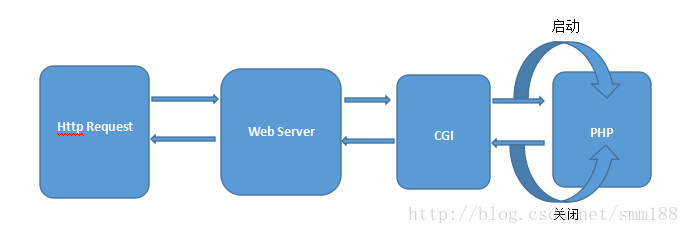
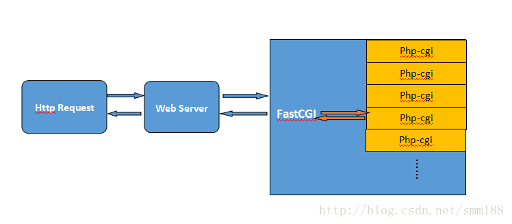
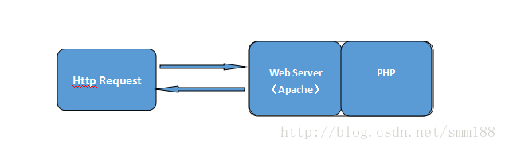
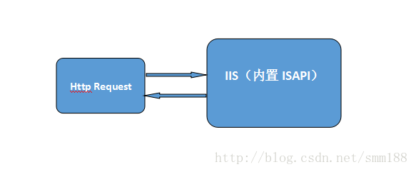

# 详解PHP的运行模式Sapi #

回顾上一节，我们已经知道了PHP是由4层体系结构组成，自下而上分别是：Zend引擎层、Extensions层、Sapi层和上层的应用。本节将为大家讲述一下Sapi层的相关内容。

一、 PHP运行模式介绍

Sapi的全称是Server Application Programming Interface，也就是服务端应用编程接口，又被称为PHP的运行模式，php运行模式的本质就是提供了与外部程序交互数据的接口，不同的运行模式对应了不同的数据交互接口，Sapi的设计使得php本身和上层的应用程序解耦隔离了，常见的有以下五种PHP运行模式：

1. CGI（通用网关接口 / Common Gateway Interface）

2. FastCGI（常驻型CGI / Long-Live CGI）

3. CLI（命令行运行 / Command Line Interface）

4. Web模块模式（Apache等Web服务器运行的模式）

5. ISAPI（Internet Server Application Program Interface）（在PHP5.3以后，PHP不再有ISAPI模式）

与PHP交互数据的外部程序主要有Apache、Nginx、IIS等web服务器。

二、 CGI模式介绍

CGI即通用网关接口，它是一段程序，通俗的讲CGI就象是一座桥，把网页和Web服务器中的执行程序连接起来，它把HTML接收的指令传递给服务器的执 行程序，再把服务器执行程序的结果返还给HTML页。CGI 的跨平台性能极佳，几乎可以在任何操作系统上实现。 CGI已经是比较老的模式了，这几年都很少用了。

CGI的特点： 跨平台性能极佳、但是性能低下，每有一个用户请求，都会先要创建CGI的子进程，然后处理请求，处理完后结束这个子进程，这就是Fork-And-Execute模式。 当用户请求数量非常多时，会大量挤占系统的资源如内存，CPU时间等，造成性能低下。

三、 FastCGI模式介绍

FastCGI是CGI的升级版本，FastCGI像是一个常驻 (long-live)型的 CGI，它可以一直执行着，只要激活后，不会每次都要花费时间去 Fork 一次 （这是 CGI 最为人诟病的 fork-and-execute 模式）。

FastCGI是一个可伸缩地、高速地在HTTP server和动态脚本语言间通信的接口。多数流行的HTTP server都支持FastCGI，包括Apache、Nginx和lighttpd等，同时，FastCGI也被许多脚本语言所支持，其中就有PHP，PHP的FastCGI进程管理器是PHP-FPM（PHP-FastCGI Process Manager）。

FastCGI模式的运行流程：

1. Web Server启动时载入FastCGI进程管理器（IIS ISAPI或Apache Module)；

2. FastCGI进程管理器自身初始化，启动多个CGI解释器进程 (可见多个php-cgi.exe或php-cig)并等待来自Web Server的连接；

3. 当客户端请求到达Web Server时，FastCGI进程管理器选择并连接到一个CGI解释器。Web server将CGI环境变量和标准输入发送到FastCGI子进程php-cgi；

4. FastCGI子进程完成处理后将标准输出和错误信息从同一连接返回Web Server。当FastCGI子进程关闭连接时，请求便告处理完成。FastCGI子进程接着等待并处理来自FastCGI进程管理器（运行在 WebServer中）的下一个连接。在正常的CGI模式中，php-cgi.exe在此便退出了。

FastCGI模式的特点： 程序稳定性好，性能比CGI更高效，但是由于是多进程模式，消耗服务器的内存资源会更多，PHP-CGI解释器的每个进程都需要消耗7至25M的内存。

三、 CLI模式介绍

PHP-CLI模式（PHP Command Line Interface），顾名思义，就是PHP在命令行运行的接口，区别于在Web服务器上运行的PHP环境（PHP-CGI，ISAPI 等）。 也就是说，PHP不单可以写前台网页，它还可以用来写后台的程序，Windows和Linux下都能支持PHP-CLI 模式。

PHP-CLI模式的特效：  使用多进程，子进程结束以后，内核会负责回收资源，子进程异常退出不会导致整个进程Thread退出，父进程还有机会重建流程，只有一个常驻主进程，负责任务分发，逻辑更清楚。

在Linux下经常使用"php –m"查找PHP安装了那些扩展，或者使用"php test.php"执行test.php文件，都是PHP命令行运行模式

四、 Web模块模式介绍

Web模块模式是以mod_php5模块的形式集成，此时mod_php5模块的作用是接收Apache传递过来的PHP文件请求，并处理这些请求，然后将处理后的结果返回给Apache。如果我们在Apache启动前在其配置文件中配置好了PHP模块（mod_php5）， PHP模块通过注册apache2的ap_hook_post_config挂钩，在Apache启动的时候启动此模块以接受PHP文件的请求。

除了这种启动时的加载方式，Apache的模块可以在运行的时候动态装载，这意味着对服务器可以进行功能扩展而不需要重新对源代码进行编译，甚至根本不需要停止服务器。我们所需要做的仅仅是给服务器发送信号HUP或者AP_SIG_GRACEFUL通知服务器重新载入模块。

但是在动态加载之前，我们需要将模块编译成为动态链接库，Apache中对动态链接库的处理是通过模块mod_so来完成的，因此mod_so模块不能被动态加载，它只能被静态编译进Apache的核心。

配置动态库的方法，以mod_php5模块为例，Linux系统下，在Apache的配置文件httpd.conf中添加一行：

	LoadModule php5_module modules/mod_php5.so  

这里使用LoadModule命令，该命令的第一个参数是模块的名称，名称可以在模块实现的源码中找到，第二个选项是该模块所处的路径，添加之后再重启服务器即可。

五、 ISAPI模式介绍

ISAPI（Internet Server Application Program Interface）是微软提供的一套面向Internet服务的API接口，一个ISAPI的DLL，可以在被用户请求激活后长驻内存，等待用户的另一 个请求，还可以在一个DLL里设置多个用户请求处理函数，此外，ISAPI的DLL应用程序和www服务器处于同一个进程中，效率要显著高于CGI，该模块只能运行于windows环境。

六、 PHP在Apache和Nginx中的运行模式

php在apache有3中运行方式：CGI模式、FastCGI模式、Apache模块DLL

Cgi模式和模块dll加载方式比较：

在Windows系统中的Cgi模式下，apache调用外部执行器php.exe执行php代码，并将解释后生成的html代码和原html整合，再传递给apache服务器，其在执行时每次都需要重新解析php.ini、重新载入全部dll扩展并重初始化全部数据结构，运行速度非常慢，但因为是外部加载执行器，php代码执行出错不会导致apache崩溃。

在模块化(DLL)中，PHP是与Web服务器一起启动并运行的，所以从某种角度上来说，以apache模块方式安装的PHP有着比CGI模式更好的安全性以及更好的执行效率和速度。

Cgi和fastcgi模式比较：

Fastcig是cgi的升级版，Cgi和fastcgi工作模式大抵相同，但fastcgi模式中fastcgi的进程管理器可用来管理cgi解释器，该管理器在cgi解释器完成请求后，会处于挂起状态，用以等待接下来的请求，因为向比较cgi每次都需要重新解析php.ini、重新载入全部dll扩展并重初始化全部数据结构，fastcig模式明显要快很多。

一般使用Apache + mod_php直接挂载模块运行代码；

而在Nginx服务器中，一般采用nginx+PHP-FPM的模式，通过FastCGI 处理进程间通讯。

七、 总结

主流的 PHP 运行模式如下所示：

Apache + mod_php 直接挂载模块运行代码，无进程通讯；

Nginx + php-fpm      通过 FastCGI 处理进程间通讯；

Nginx 和 Apache充当Web服务器时所扮演的角色是不一样的，Nginx本质是一个反向代理服务，而 Apache 是一个可以直接运行 PHP的HTTP 服务。也就是说，除了PHP之外，NodeJS、Golang 等语言在运行的时候，都是需要自行处理 HTTP 或者 FastCGI 协议的，Nginx 只管将HTTP请求或者是 FastCGI 转发给其它进程。而 Apache 则是直接在自己进程内部完成 PHP 的运行并直接返回结果。

因此 Nginx 在运行 PHP 时，需要 PHP 自己启动 php-fpm 管理一个进程池，并监听在一个 TCP 端口（最常见的 9000 / 9001）或者 Unix Socket 等待 Nginx 通过 FastCGI 转发请求过来。所以性能方面无论如何都躲避不了进程通讯的 IO 性能消耗，这点不如 Apache 性能好。

几年前 LAMP（Linux Apache MySQL PHP）非常火爆，然而现在使用 Apache 似乎有一点非主流的味道，大家对 Apache 的印象是速度慢，配置难，不过到了 Apache 2.4，性能已经基本和 Nginx 相当。

参考

深入理解Zend SAPIs(Zend SAPI Internals) http://www.laruence.com/2008/08/12/180.html

图解PHP的几种运行模式   https://blog.csdn.net/smm188/article/details/54743671

PHP比较常见的五大运行模式详解  https://blog.csdn.net/xiaoxiaoqiye/article/details/52094004

基于php在各种web服务器的运行模式详解  http://www.jb51.net/article/37759.htm

PHP运行模式    https://blog.csdn.net/hguisu/article/details/7386882

对比 PHP 各种运行模式    http://www.90.cx/php-mode/