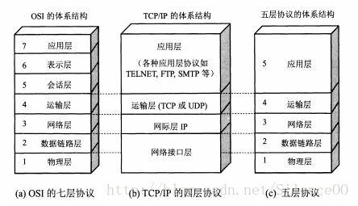

基本概念详解之三——网络协议介绍

什么是协议？

协议，网络协议的简称，网络协议是通信计算机双方必须共同遵从的一组约定。如怎么样建立连接、怎么样互相识别等。只有遵守这个约定，计算机之间才能相互通信交流。它的三要素是：语法、语义、时序。

(1)语法：即数据与控制信息的结构或格式；
(2)语义：即需要发出何种控制信息，完成何种动作以及做出何种响应；
(3)时序（同步），即事件实现顺序的详细说明。

为了使数据在网络上从源到达目的，网络通信的参与方必须遵循相同的规则，这套规则称为协议（protocol），它最终体现为在网络上传输的数据包的格式。

协议往往分成几个层次进行定义，分层定义是为了使某一层协议的改变不影响其他层次的协议。

OSI七层模型的划分

OSI定义了网络互连的七层框架（物理层、数据链路层、网络层、传输层、会话层、表示层、应用层），即ISO开放互连系统参考模型。

每一层实现各自的功能和协议，并完成与相邻层的接口通信。OSI的服务定义详细说明了各层所提供的服务。某一层的服务就是该层及其下各层的一种能力，它通过接口提供给更高一层。各层所提供的服务与这些服务是怎么实现的无关。

应用层
OSI 参考模型中最靠近用户的一层，是为计算用户提供应用接口，也为用户直接提供网络服务。常见的应用层网络服务协议有：HTTP,HTTPS,FTP,POP3,SMTP等

表示层
表示提供各种用于应用层数据编码和转换功能，确保一个系统的应用层发送的数据能被另一个系统的应用层识别。如果必要该层可提供一种标准表示形式，用于将计算机内部的多种数据格式转换成通信中采用的标准表示形式。数据压缩和加密也是表示层可提供的转换功能之一。

会话层
会话层负载建立、管理和终止表示层实体之间的通信会话。该层的通信由不同设备中的应用程序之间的服务请求和响应组成。

传输层
传输层建立了主机端到端的链接，传输层的作用是为上层协议提供端到端的可靠和透明的数据传输服务，包括处理差错控制和流量控制等问题。该层向高层屏蔽了下层数据通信的细节，是高层用户看到的只是在两个传输实体建的一个主机到主机的、可由用户控制和设定、可靠的数据通路。通常说的TCP UDP就是在这层。端口号即是这里的“端”。

网络层
本层通过IP寻址来建立两点之间的连接，为源端的运输层来的分组，选择合适的路由和交换节点，正确无误地按照地址传送给目的端的运输层。就是通常说的ip层。这一层就是我们经常说的IP协议层。IP协议是Internet的基础。

数据链路层
将比特组合成字节，再将字节组成帧，使用链路层地址（以太网mac地址）来访问介质，并进行差错检测。
数据链路层又分为2个子层：逻辑链路控制子层（LLC）和媒体访问控制子层（MAC）。

物理层
实际最终信号传输是通过物理层实现的。通过物理介质传输比特流。规定电平、速度和电缆针脚。常用设备有（各种物理设备）集线器、中继器、调制解调器、网线、双绞线、同轴电缆。这些都是物理层的传输介质。

TCP/IP五层模型

OSI七层模型只是参考模型，在实际使用中，都采用TCP/IP五层模型，见下图所示

TCP/IP五层模型对应使用的协议

应用层：文件传输，电子邮件，文件服务，虚拟终端 TFTP，HTTP，SNMP，FTP，SMTP，DNS，Telnet 

传输层：提供端对端的接口 TCP，UDP

网络层：为数据包选择路由 IP，ICMP，RIP，OSPF，BGP，IGMP

数据链路层：传输有地址的帧以及错误检测功能 SLIP，CSLIP，PPP，ARP，RARP，MTU

物理层：以二进制数据形式在物理媒体上传输数据 ISO2110，IEEE802，IEEE802.2

有些TCP/IP模型的划分将数据链路层和物理层合并了，其实都大同小异，见下图：

应用层协议是什么？

应用层协议(application layer protocol)定义了运行在不同端系统上的应用程序进程如何相互传递报文。应用层协议就是TCP/IP五层模型中的应用层所使用的协议。应用层协议的定义主要包括以下四部分：

(1)交换的报文类型，如请求报文和响应报文；
(2)各种报文类型的语法，如报文中的各个字段公共详细描述;
(3)字段的语义，即包含在字段中信息的含义；
(4)进程何时、如何发送报文及对报文进行响应。

有些应用层协议是由RFC文档定义的，因此它们位于公共领域。例如，web的应用层的协议HTTP(超文本传输协议，RFC 2616)就作为一个RFC供大家使用。如果浏览器开发者遵从HTTP RFC规则，所开发出的浏览器就能访问任何遵从该文档标准的web，服务器并获取相应的web页面。

还有很多别的应用层协议是专用的．不能随意应用于公共领域。例如，很多现有的P2P文件共享系统使用的是专用应用层协议。

常用的应用层协议有： 

DNS：域名系统
FTP：文件传输协议
Telnet：远程终端协议
HTTP：超文本传送协议
SMTP：电子邮件协议
POP3：邮件读取协议
SNMP：简单网络管理协议

HTTP协议是什么？

HTTP（HyperText Transfer Protocol)是超文本（文本、图片、视频等）传输协议，是一种基于TCP的应用层协议，所有的WWW文件都必须遵守这个标准。设计HTTP最初的目的是为了提供一种发布和接收HTML页面的方法。1960年美国人Ted Nelson构思了一种通过计算机处理文本信息的方法，并称之为超文本（hypertext）,这成为了HTTP超文本传输协议标准架构的发展根基。Ted Nelson组织协调万维网协会（World Wide Web Consortium）和互联网工程工作小组（Internet Engineering Task Force ）共同合作研究，最终发布了一系列的RFC，其中著名的RFC 2616定义了HTTP 1.1。

下一节将会详细介绍Http协议的内容。

OSI七层模型与TCP/IP五层模型  https://www.cnblogs.com/qishui/p/5428938.html

OSI七层协议模型、TCP/IP四层模型和五层协议体系结构之间的关系   https://www.cnblogs.com/wxd0108/p/7597216.html