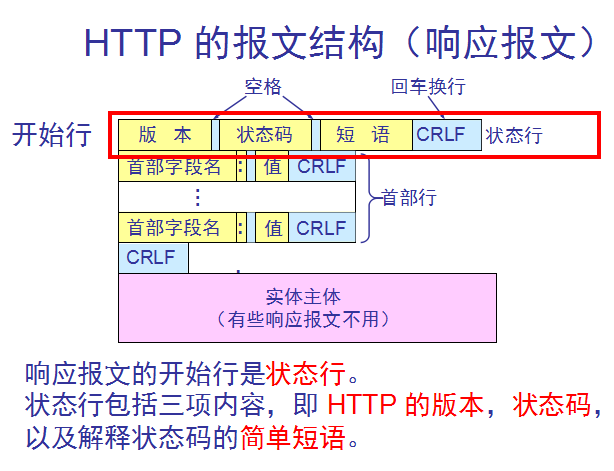
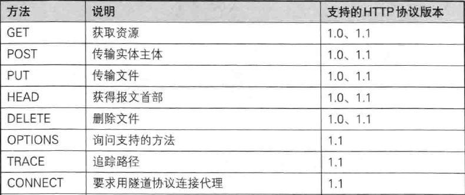
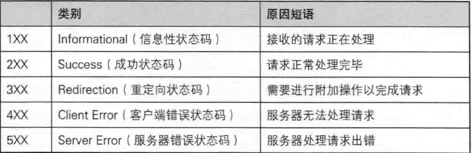
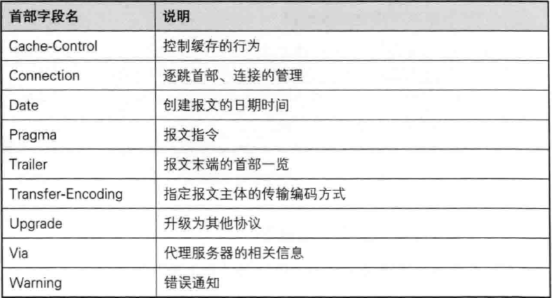
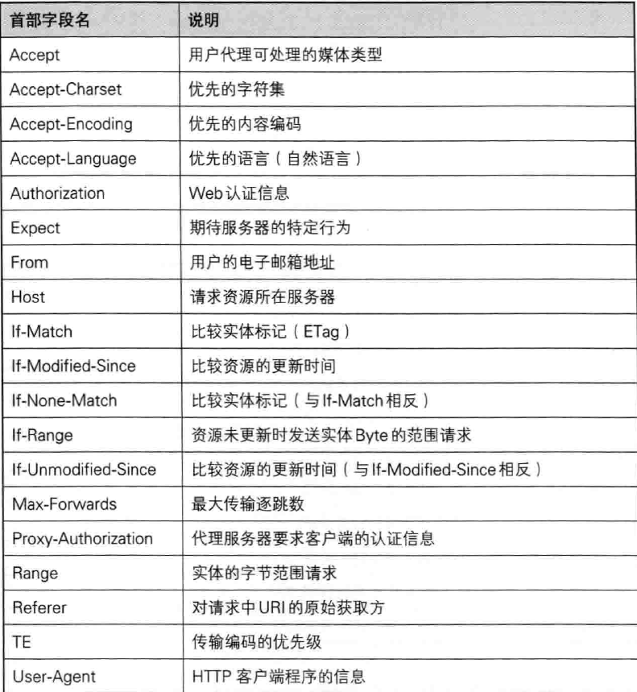
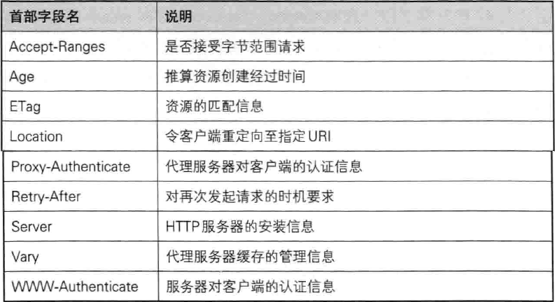

基本概念详解之四——Http协议详解

本文主要转载自   Pickle 理解Http协议  https://www.cnblogs.com/wxisme/p/6212797.html

什么是Http协议？

HTTP（HyperText Transfer Protocol)是超文本（文本、图片、视频等）传输协议，是一种基于TCP的应用层协议，所有的WWW文件都必须遵守这个标准。设计HTTP最初的目的是为了提供一种发布和接收HTML页面的方法。1960年美国人Ted Nelson构思了一种通过计算机处理文本信息的方法，并称之为超文本（hypertext）,这成为了HTTP超文本传输协议标准架构的发展根基。Ted Nelson组织协调万维网协会（World Wide Web Consortium）和互联网工程工作小组（Internet Engineering Task Force ）共同合作研究，最终发布了一系列的RFC，其中著名的RFC 2616定义了HTTP 1.1。

URI与URL的区别？

　问： 为什么要区别URI与URL呢？

　　答：因为我看书看博客资料都遇到过着两个名词，第一次遇到是在学习API的时候，那时候我是一脸懵逼，不是怎么区分，感觉看过去都是一串网址呀！事实并非如此。

　　URI：统一资源标示符，只是标识资源在哪里，这意味着存在多个URI可以指向该资源（例如：绝对与相对）【URI包含URL】

　　URI一般由三部分组成：
　　　　1. 访问资源的命名机制。 
　　　　2. 存放资源的主机名。 
　　　　3. 资源自身的名称，由路径表示。 

　　语法：[scheme:] scheme-specific-part 

　　URI以scheme和冒号开头。Scheme用大写/小写字母开头，后面为空或者跟着更多的大写/小写字母、数字、加号、减号和点号。冒号把 scheme与scheme-specific-part分开了，并且scheme-specific-part的语法和语义（意思）由URI的名字空间决定。如下面的例子：
　　http://www.cnn.com，其中http是scheme，//www.cnn.com是 scheme-specific-part，并且它的scheme与scheme-specific-part被冒号分开了。

　　绝对与相对：

　　绝对的URI指以scheme（后面跟着冒号）开头的URI。(例如：mailto:jeff@javajeff.com、news:comp.lang.java.help和xyz: //whatever)；绝对的URI看作是以某种方式引用某种资源，而这种方式对标识符出现的环境没有依赖。

　　相对的URI不是以scheme（后面跟着冒号）开始的URI。(例如：articles/articles.html、img/aa.jpg)你可以把相对的URI看作是以某种方式引用某种资源，而这种方式依赖于标识符出现的环境。（即你在html中引用图片：./img/aa.jpg，那么它依赖的就是http）

　　URL：统一资源定位符，是URI的子集；它除了标识资源的位置，还提供一种定位该资源的主要访问机制(如其网络“位置”)。【即提供具体方式找到该资源（位置+方式）】

　　URL的格式由下列三部分组成： 
　　　　1. 第一部分，是协议或称为服务方式 （指定低层使用的协议，例如：http, https, ftp)；
　　　　2. 第二部分，是存有该资源的主机IP地址（有时也包括端口号）； 
　　      3. 第三部分，是主机资源的具体地址。如目录和文件名等。 

　　第一部分和第二部分之间用"：//"符号隔开，第二部分和第三部分用"/"符号隔开。第一部分和第二部分是不可缺少的，第三部分有时可以省略。

一、HTTP协议的演进

　　HTTP（HyperText Transfer Protocol）协议是基于TCP的应用层协议，它不关心数据传输的细节，主要是用来规定客户端和服务端的数据传输格式，最初是用来向客户端传输HTML页面的内容。默认端口是80。

　　1.HTTP 0.9版本　　1991年

　　这个版本就是最初用来向客户端传输HTML页面的，所以只有一个GET命令，然后服务器返回客户端一个HTML页面，不能是其他格式。利用这个版本完全可以构建一个简单的静态网站了。

　　2.HTTP 1.0版本　　1996年

　　1.0版本是改变比较大的，奠定了现在HTTP协议的基础。这个版本的协议不仅可以传输HTML的文本页面，还可以传输其他二进制文件，例如图片、视频。而且还增加了现在常用的POST和HEAD命令。请求消息和响应消息也不是单一的了，规定了一些元数据字段。例如字符集、编码、状态响应码等。

　　3.HTTP 1.1版本　　1997年

　　实际上是在1.0版本之后半年时间又发布了一个版本，这个版本在1.0版本的基础上更加完善了。这个版本增加了持久连接，就是说之前版本的协议一次请求就是一次TCP连接，请求完成后这个连接就关闭掉了。众所周知TCP协议是可靠的，建立连接需要3次握手，断开连接需要4次挥手，并且TCP有流量控制和拥塞控制，有慢开始机制，刚建立连接时传输比较慢，这是比较耗费资源的。一个丰富的页面会有许多图片、表单和超链接。这样的话就会有多次的HTTP请求，所以在这个版本上默认不关闭TCP连接也不用声明Connection: keep-alive字段。如果确实要关闭可以指定Connection: close字段。还引入了管道机制，就是说在一个TCP连接里可以同时发送多个HTTP请求，而不必等待上一个请求响应成功再发送。还增加了PUT、PATCH、HEAD、 OPTIONS、DELETE等命令，丰富了客户端和服务端交互动作。还增加了Host字段。

　　4.HTTP 2版本　　2015年

　　这个版本也是随着互联网的发展，有了新的需求制定了新的功能还有对上一个版本的完善。1.1版本有了管道机制，但是正在服务端还是要对请求进行排队处理。这个版本可以多工的处理。还有了头信息压缩和服务器的主动推送。

　　5.HTTPS

　　HTTPS是HTTP协议的安全版本，HTTP协议的数据传输是明文的，是不安全的，HTTPS使用了SSL/TLS协议进行了加密处理。

　　关于HTTP协议历史演进的详细介绍请参考：http://www.ruanyifeng.com/blog/2016/08/http.html

　　下面介绍没有特殊说明默认HTTP/1.1版本

二、HTTP协议的特点

　　1.HTTP协议是无状态的

　　就是说每次HTTP请求都是独立的，任何两个请求之间没有什么必然的联系。但是在实际应用当中并不是完全这样的，引入了Cookie和Session机制来关联请求。

　　2.多次HTTP请求

　　在客户端请求网页时多数情况下并不是一次请求就能成功的，服务端首先是响应HTML页面，然后浏览器收到响应之后发现HTML页面还引用了其他的资源，例如，CSS，JS文件，图片等等，还会自动发送HTTP请求这些需要的资源。现在的HTTP版本支持管道机制，可以同时请求和响应多个请求，大大提高了效率。

　　3.基于TCP协议

　　HTTP协议目的是规定客户端和服务端数据传输的格式和数据交互行为，并不负责数据传输的细节。底层是基于TCP实现的。现在使用的版本当中是默认持久连接的，也就是多次HTTP请求使用一个TCP连接。

三、HTTP报文

　　1.请求报文

　　举例：

复制代码
GET /wxisme HTTP/1.1  
Host: www.cnblogs.com 
User-Agent: Mozilla/5.0 (Windows; U; Windows NT 5.0; zh-CN; rv:1.8.1) Gecko/20061010 Firefox/2.0  
Accept: text/xml,application/xml,application/xhtml+xml,text/html;q=0.9,text/plain;q=0.8,image/png,*/*;q=0.5  
Accept-Language: en-us,zh-cn;q=0.7,zh;q=0.3  
Accept-Encoding: gzip,deflate  
Accept-Charset: gb2312,utf-8;q=0.7,*;q=0.7  
Keep-Alive: 300  
Proxy-Connection: keep-alive  
Cookie: ASP.NET_SessionId=ey5drq45lsomio55hoydzc45
Cache-Control: max-age=0
复制代码
　　简单来说请求报文就是由请求行、请求头、内容实体组成的，注意，每一行的末尾都有回车和换行，在内容实体和请求头之间另有一个空行。其中请求行指定的是请求方法、请求URL、协议版本；请求头是键值对的形式存在的，就是字段名：值；内容实体就是要传输的数据。稍后会对方法、请求头字段做详细的说明。

　　2.响应报文

　　

　　举例：

复制代码
HTTP/1.1 200 OK
Date: Tue, 12 Jul 2016 21:36:12 GMT
Content-Length: 563
Content-Type: text/html

<html>
    <body>
    Hello http!
    </body>
</html>
复制代码
　　简单来说响应报文由状态行、响应首部字段（响应头）、响应实体组成，其中第一行是状态行，依次包含HTTP版本，状态码和状态短语组成；在一个回车换行之后是响应头，也是键值对的形式，字段名：值；然后会有一个空行也包含回车换行，之后是响应实体，就是要传输的数据。在上面的例子当中就是一个非常简单的HTML页面。对于响应状态码，首部字段键值对稍后会有更加详细的说明。

四、HTTP请求方法

　　请求方法是客户端用来告知服务器其动作意图的方法。就像下达命令一样。在HTTP1.1版本中支持GET、POST等近10种方法。需要注意的是方法名区分大小写，需要用大写字母。下面详细说明。

　　1.GET：获取资源

　　GET方法用来请求访问已被URI识别的资源。也就是指定了服务器处理请求之后响应的内容。

　　2.POST：传输实体主体

　　POST方法用来传输实体主体。POST与GET的区别之一就是目的不同，二者之间的区别会在文章的最后详细说明。虽然GET方法也可以传输，但是一般不用，因为GET的目的是获取，POST的目的是传输。

　　3.PUT：传输文件

　　PUT方法用来传输文件。类似FTP协议，文件内容包含在请求报文的实体中，然后请求保存到URL指定的服务器位置。

　　4.HEAD：获得报文首部

　　HEAD方法类似GET方法，但是不同的是HEAD方法不要求返回数据。用于确认URI的有效性及资源更新时间等。

　　5.DELETE：删除文件

　　DELETE方法用来删除文件，是与PUT相反的方法。DELETE是要求返回URL指定的资源。

　　6.OPTIONS：询问支持的方法

　　因为并不是所有的服务器都支持规定的方法，为了安全有些服务器可能会禁止掉一些方法例如DELETE、PUT等。那么OPTIONS就是用来询问服务器支持的方法。

　　7.TRACE：追踪路径

　　TRACE方法是让Web服务器将之前的请求通信环回给客户端的方法。这个方法并不常用。

　　8.CONNECT：要求用隧道协议连接代理

　　CONNECT方法要求在与代理服务器通信时建立隧道，实现用隧道协议进行TCP通信。主要使用SSL/TLS协议对通信内容加密后传输。

　　汇总：

五、HTTP的响应状态码

　　状态码是用来告知客户端服务器端处理请求的结果。凭借状态码用户可以知道服务器是请求处理成功、失败或者是被转发；这样出现了错误也好定位。状态码是由3位数字加原因短语组成。3位数字中的第一位是用来指定状态的类别。共有5种。

            

　　HTTP状态码一共有60多种，但是不用全部都记住，因为大部分在工作当中是不经常使用的。经常使用的大概就是16种，下面来详细介绍。（其实最最常用的也就8种，下面有背景色的就是）

　　1. 200：OK

　　这个没有什么好说的，是代表请求被正常的处理成功了。

　　2. 204：No Content

　　请求处理成功，但是没有数据实体返回，也不允许有实体返回。比如说HEAD请求，可能就会返回204 No Content，因为HEAD就是只获取头信息。这里简单提一下205 Reset Content，和204 No Content的区别是不但没有数据实体返回，而且还需要重置表单，方便用户再次输入。

　　3. 206：Partial Content

　　这是客户端使用Content-Range指定了需要的实体数据的范围，然后服务端处理请求成功之后返回用户需要的这一部分数据而不是全部，执行的请求就是GET。返回码就是206：Partial Content。

　　4. 301 ： Moved Permanently

　　代表永久性定向。该状态码表示请求的资源已经被分配了新的URL，以后应该使用资源现在指定的URL。也就是说如果已经把资源对应的URL保存为书签了，这是应该按照Location首部字段提示的URL重新保存。

　　5. 302：Found

　　代表临时重定向。该状态码表示请求的资源已经被分配了新的URL，但是和301的区别是302代表的不是永久性的移动，只是临时的。就是说这个URL还可能会发生改变。如果保存成书签了也不会更新。

　　6. 303：See Other

　　和302的区别是303明确规定客户端应当使用GET方法。

　　7. 304：Not Modified

　　该状态码表示客户端发送附带条件请求时，服务器端允许请求访问资源，但是没有满足条件。304状态码返回时不包含任何数据实体。304虽然被划分在3XX中但是和重定向没有关系。

　　8. 307：Temporary Redirect

　　临时重定向，与302 Found相同，但是302会把POST改成GET，而307就不会。

　　9.  400：Bad Request

　　400表示请求报文中存在语法错误。需要修改后再次发送。

　　10. 401：Unauthorized

　　该状态码表示发送的请求需要有通过HTTP认证的认证信息。

　　11. 403：Forbidden

　　表明请求访问的资源被拒绝了。没有获得服务器的访问权限，IP被禁止等。

　　12. 404：Not Found

　　表明请求的资源在服务器上找不到。当然也可以在服务器拒绝请求且不想说明理由时使用。

　　13. 408：Request Timeout

　　表示客户端请求超时，就是在客户端和服务器建立连接后服务器在一定时间内没有收到客户端的请求。

　　14. 500：Internal Server Error

　　表明服务器端在执行请求时发生了错误，很有可能是服务端程序的Bug或者临时故障。

　　15. 503：Service Unavailable

　　表明服务器暂时处于超负载或正在进行停机维护，现在无法处理请求。如果事先得知解除以上状况需要的时间，最好写入Retry-After字段再返回给客户端。

　　16. 504：Getaway Timeout

　　网关超时，是代理服务器等待应用服务器响应时的超时，和408 Request Timeout的却别就是504是服务器的原因而不是客户端的原因

　　更加详细的状态码请参考：http://tool.oschina.net/commons?type=5

六、HTTP的首部字段

　　HTTP首部字段是构成HTTP报文最重要的元素之一。在客户端与服务端之前进行信息传递的时候请求和响应都会使用首部字段，会传递一些重要的元信息。首部字段是以键值对的形式存在的。包含报文的主体大小、语言、认证信息等。HTTP首部字段包含4种类型：

　　通用首部字段（General Header Fields）

　　代表请求报文和响应报文都会使用的字段

　　请求首部字段（Request Header Fields）

　　是客户端向服务端发送请求时使用的首部字段。包含请求的附加内容、客户端信息、响应内容相关优先级等信息。

　　响应首部字段（Response Header Fields）

　　是服务端向客户端返回响应时使用的首部字段，包含响应的附加内容，可能也会要求客户端附加额外的内容信息。

　　实体首部字段（Entity Header Fields）

　　是针对请求报文和响应报文的实体部分使用的首部。包含资源内容更新时间等和实体有关的信息。

　　在HTTP/1.1种规定了47种首部字段（图表参考《图解HTTP》，感谢作者。）

　　通用首部字段

　　      

　　请求首部字段

　　      

　　响应首部字段

　　      

　　实体首部字段

　　      

　　其他首部字段

 Cookie、Set-Cookie、Content-Disposition、Connection、Keep-Alive、Proxy-Authenticate、Proxy-Authorization、Trailer、TE、Transfer-Encoding、Upgrade etc...

　　这么多的首部字段，估计如果不是很了解会被吓着，但是根本不用全部记住，其实字段的名字就说明了作用，看一眼就大概知道是干啥的了，只不过有些类似的字段要区分一下就好了。只要深刻理解了HTTP的设计思路就没有大问题了，熟悉常见的就可以了。用到的时候想了解细节再去查。

　　关于首部字段的细节请参考《图解HTTP》或者《HTTP权威指南》的首部字段部分。够再写一篇长博客的了~

　　以上就把HTTP协议的重点内容——报文格式、方法、状态码、首部字段介绍完了，可以说对HTTP协议有了一些了解。下面就工作中的常见问题（或者说面试中的）做一个总结。^_^

七、关于HTTP的常见问题及解答

 　　1.GET和POST的区别

　　A. 从字面意思和HTTP的规范来看，GET用于获取资源信息而POST是用来更新资源信息。

　　B. GET提交请求的数据实体会放在URL的后面，用?来分割，参数用&连接，举个栗子：/index.html?name=wang&login=1

　　C. GET提交的数据长度是有限制的，因为URL长度有限制，具体的长度限制视浏览器而定。而POST没有。

　　D. GET提交的数据不安全，因为参数都会暴露在URL上。

　　2.408 Request Timeout和504 Gateway Timeout的区别

　　408是说请求超时，就是建立连接之后再约定的时间内客户端没有发送请求到客户端到服务端。本质上原因在于客户端或者网络拥塞。504是网关超时，是说代理服务器把客户端请求转发到应用服务器后再约定的时间内没有收到应用服务器的响应。本质上原因在于服务端的响应过慢，也有可能是网络问题。

　　3.Cookie和Session的区别和联系

　　Cookie和Session都是为了保存客户端和服务端之间的交互状态，实现机制不同，各有优缺点。首先一个最大的区别就是Cookie是保存在客户端而Session就保存在服务端的。Cookie是客户端请求服务端时服务器会将一些信息以键值对的形式返回给客户端，保存在浏览器中，交互的时候可以加上这些Cookie值。用Cookie就可以方便的做一些缓存。Cookie的缺点是大小和数量都有限制；Cookie是存在客户端的可能被禁用、删除、篡改，是不安全的；Cookie如果很大，每次要请求都要带上，这样就影响了传输效率。Session是基于Cookie来实现的，不同的是Session本身存在于服务端，但是每次传输的时候不会传输数据，只是把代表一个客户端的唯一ID（通常是JSESSIONID）写在客户端的Cookie中，这样每次传输这个ID就可以了。Session的优势就是传输数据量小，比较安全。但是Session也有缺点，就是如果Session不做特殊的处理容易失效、过期、丢失或者Session过多导致服务器内存溢出，并且要实现一个稳定可用安全的分布式Session框架也是有一定复杂度的。在实际使用中就要结合Cookie和Session的优缺点针对不同的问题来设计解决方案。
  
参考

《图解HTTP》、HTTP协议入门 、HTTP状态码详解

Pickle 理解Http协议    https://www.cnblogs.com/wxisme/p/6212797.html

阮一峰的HTTP 协议入门  http://www.ruanyifeng.com/blog/2016/08/http.html

HTTP协议详解以及URL具体访问过程   http://www.cnblogs.com/phpstudy2015-6/p/6810130.html