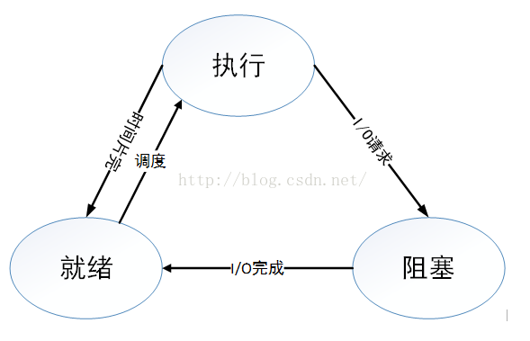
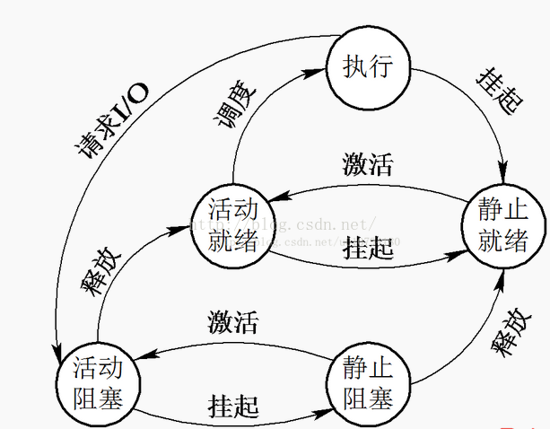

基本概念详解之五——什么是进程

引言

进程是操作系统中最基本、重要的概念。是多道程序系统出现后，为了刻画系统内部出现的动态情况，描述系统内部各道程序的活动规律引进的一个概念,所有多道程序设计操作系统都建立在进程的基础上。

从进程角度描述操作系统的运行过程

进程是操作系统执行任务的核心，操作系统以进程为基本单位来分配系统资源，系统的管理架构也是基于进程层面的。第一个被创造出来的进程是0号进程，这个进程在操作系统层面是不可见的，但它是存在着，0号进程完成了操作系统的功能加载与初期设定，然后它创造了1号进程(init)，这个1号进程就是操作系统的管理员，1号进程是用来管理整个操作系统的，在Linux中使用pstree查看进程树可知，1号进程位于树根。系统的很多管理程序都以进程身份被1号进程创造出来，它还创造了与用户沟通的桥梁——shell。用户可以跟操作系统进行交流，可以编写程序，可以执行任务等。

进程定义

狭义定义： 进程是程序执行时的一个实例

广义定义： 进程是一个具有一定独立功能的程序关于某个数据集合的一次运行活动。它是操作系统动态执行的基本单元，在传统的操作系统中，进程既是基本的分配单元，也是基本的执行单元。  

进程的本质

第一，进程是一个实体。每一个进程都有它自己的地址空间，一般情况下，包括文本区域（text region）、数据区域（data region）和堆栈（stack region）。文本区域存储处理器执行的代码；数据区域存储变量和进程执行期间使用的动态分配的内存；堆栈区域存储着活动过程调用的指令和本地变量。

第二，进程是一个“执行中的程序”。程序是一个没有生命的实体，只有处理器赋予程序生命时（操作系统执行之），它才能成为一个活动的实体，我们称其为进程。

进程的特点

1. 动态性：进程的实质是程序在多道程序系统中的一次执行过程，进程是动态产生，动态消亡的
 
2. 并发性：任何进程都可以同其他进程一起并发执行

3. 独立性：进程是一个能独立运行的基本单位，同时也是系统分配资源和调度的独立单位，各个进程都运行在独立的虚拟地址空间，因此，即使一个进程发生异常，它也不会影响到系统中的其他进程。

4. 异步性：由于进程间的相互制约，使进程具有执行的间断性，即进程按各自独立的、不可预知的速度向前推进

5. 结构特征：进程由程序、数据和进程控制块三部分组成

进程的内存空间

进程的内存空间包含3个段，分别为数据段、代码段（文本区域）和堆栈段。 

1. 数据段存放的是全局变量、常数以及动态数据分配的数据空间
	
2. 代码段存放的是程序代码的数据
	
3. 堆栈段存放的是子程序的返回地址、子程序的参数以及程序的局部变量等

进程的运行状态

三态模型

一般来说，进程有三个状态，即就绪状态，运行状态，阻塞状态

运行态：进程占用CPU，并在CPU上运行
就绪态：进程已经具备运行条件，但是CPU还没有分配过来
阻塞态：进程因等待某件事发生而暂时不能运行

理论上上述三种状态之间转换分为六种情况；

      运行——>就绪：1，主要是进程占用CPU的时间过长，而系统分配给该进程占用CPU的时间是有限的；2，在采用抢先式优先级调度算法的系统中,当有更高优先级的进程要运行时，该进程就被迫让出CPU，该进程便由执行状态转变为就绪状态。

      就绪——>运行：运行的进程的时间片用完，调度就转到就绪队列中选择合适的进程分配CPU

      运行——>阻塞：正在执行的进程因发生某等待事件而无法执行，则进程由执行状态变为阻塞状态，如发生了I/O请求

      阻塞——>就绪:进程所等待的事件已经发生，就进入就绪队列

 

      以下两种状态是不可能发生的：

      阻塞——>运行：即使给阻塞进程分配CPU，也无法执行，操作系统在进行调度时不会从阻塞队列进行挑选，而是从就绪队列中选取

      就绪——>阻塞：就绪态根本就没有执行，谈不上进入阻塞态。

五态模型

在一个实际的系统里进程的状态及其转换比上节叙述的复杂一些，例如，引入专门的初始态(new)和终止态(exit )，这样进程有五个状态，即就初始状态，就绪状态，运行状态，阻塞状态，终止状态。

为什么需要初始态和终止态

引入初始态和终止态对于进程管理来说是非常有用的。初始态对应于进程刚刚被创建的状态，创建1个进程要通过两个步骤，首先，是为一个新进程创建必要的管理信息；然后，让该进程进入就绪态。此时进程将处于初始态，它并没有被提交执行，而是在等待操作系统完成创建进程的必要操作。必须指出的是，操作系统有时将根据系统性能或主存容量的限制推迟初始态进程的提交。

类似地，进程的终止也要通过两个步骤，首先，是等待操作系统进行善后；然后，退出主存。当一个进程到达了自然结束点，或是出现了无法克服的错误，或是被操作系统所终结，或是被其他有终止权的进程所终结，它将进入终止态。进入终止态的进程以后不再执行，但依然保留在操作系统中等待善后。一旦其他进程完成了对终止态进程的信息抽取之后，操作系统将删除该进程。

其它状态

在一些系统中，又增加了一些新状态，如挂起状态，可运行状态，深度睡眠状态，浅度睡眠状态，暂停状态，僵死状态。

可运行状态：运行状态和就绪状态的合并，表示进程正在运行或准备运行，Linux 中使用TASK_RUNNING 宏表示可运行状态。

浅度睡眠状态：进程正在睡眠（被阻塞），等待资源的到来是唤醒，也可以通过其他进程信号或时钟中断唤醒，进入运行队列。Linux 中使用TASK_INTERRUPTIBLE 宏表示此状态。

深度睡眠状态：其和浅度睡眠基本类似，但不可被其他进程信号或时钟中断唤醒。Linux 中使用TASK_UNINTERRUPTIBLE 宏表示此状态。

暂停状态：进程暂停执行接受某种处理。Linux 使用TASK_STOPPED 宏表示此状态。

僵死状态：进程已经结束但未释放进程控制块（PCB），Linux 使用TASK_ZOMBIE 宏表示此状态。

挂起状态：在执行状态的进程通过挂起即可进入就绪状态，如图所示，就绪状态和阻塞状态都分为活动态和静止态。由活动态向静止态转换就是通过挂起实现的。

引入挂起状态的原因

1. 终端用户的请求。当终端用户在自己的程序运行期间发现有可疑问题时，希望暂时使自己的程序静止下来。亦即，使正在执行的进程暂停执行；若此时用户进程正处于就绪状态而未执行，则该进程暂不接受调度，以便用户研究其执行情况或对程序进行修改。我们把这种静止状态称为挂起状态。　

2. 父进程请求。有时父进程希望挂起自己的某个子进程，以便考查和修改该子进程，或者协调各子进程间的活动。

3. 负荷调节的需要。当实时系统中的工作负荷较重，已可能影响到对实时任务的控制时，可由系统把一些不重要的进程挂起，以保证系统能正常运行。

4. 操作系统的需要。操作系统有时希望挂起某些进程，以便检查运行中的资源使用情况或进行记账。

具有挂起状态的进程状态转换图如下：

进程和程序的区别

1. 动静态性质： 程序是指令和数据的有序集合，其本身没有任何运行的含义，是一个静态的概念；而进程是程序在处理机上，通过程序的指令来控制产生的一次执行过程，它是一个动态的概念

2. 时效性质： 程序可以作为一种软件资料长期存在，而进程是有一定生命期的，程序是永久的，进程是暂时的

3. 关联性质： 同一程序同时运行于若干个数据集合上，它将属于若干个不同的进程，也就是说同一程序可以对应多个进程，进程通过程序的指令集合来控制生成，一个程序可以只有一个进程，也可以包含多个进程

通常在一个进程中可以包含若干个线程，它们可以利用进程所拥有的资源，在引入线程的操作系统中，通常都是把进程作为分配资源的基本单位，而把线程作为独立运行和独立调度的基本单位，由于线程比进程更小，基本上不拥有系统资源，故对它的调度所付出的开销就会小得多，能更高效的提高系统内多个程序间并发执行的程度。

线程是进程的一个执行流，是CPU调度和分派的基本单位，它是比进程更小的能独立运行的基本单位。 
一个进程由几个线程组成（拥有很多相对独立的执行流的用户程序共享应用程序的大部分数据结构），线程与同属一个进程的其他的线程共享进程所拥有的全部资源。 
进程——资源分配的最小单位，线程——程序执行的最小单位” 
进程有独立的地址空间，一个进程崩溃后，在保护模式下不会对其它进程产生影响，而线程只是一个进程中的不同执行路径。 
线程有自己的堆栈和局部变量，但线程没有单独的地址空间，一个线程死掉就等于整个进程死掉，所以多进程的程序要比多线程的程序健壮，但在进程切换时，耗费资源较大，效率要差一些。但对于一些要求同时进行并且又要共享某些变量的并发操作，只能用线程，不能用进程。

使用多线程到底有哪些好处？**

运行于一个进程中的多个线程，它们之间使用相同的地址空间，而且线程间彼此切换所需的时间也远远小于进程间切换所需要的时间.据统计，一个进程的开销大约是一个线程开销的30倍左右。

使用多线程的理由之二是： 
线程间方便的通信机制。对不同进程来说，它们具有独立的数据空间，要进行数据的传递只能通过进程间通信的方式进行，这种方式不仅费时，而且很不方便。线程则不然，由于同一进程下的线程之间共享数据空间，所以一个线程的数据可以直接为其它线程所用，这不仅快捷，而且方便。

除了以上所说的优点外，多线程程序作为一种多任务、并发的工作方式，有如下优点： 
使多CPU系统更加有效.操作系统会保证当线程数不大于CPU数目时，不同的线程运行于不同的CPU上. 
改善程序结构.一个既长又复杂的进程可以考虑分为多个线程，成为几个独立或半独立的运行部分，这样的程序会利于理解和修改.

Linux系统下的多线程遵循POSIX线程接口，称为pthread。编写Linux下的多线程程序，需要使用头文件pthread.h，连接时需要使用libpthread.a

一、什么是线程？

我们知道,进程在各自独立的地址空间中运行,进程之间共享数据需要用mmap或者进程间通信机制，但是有些情况需要在一个进程中同时执 行多个控制流程，这时候线程就派上了用场。

实际上，在Linux下没有真正意义上的线程，它是由进程模拟出来的。

进程是承担分配系统资源的基本实体，线程是操作系统或进程调度的最小单位，线程是进程的执行分支，线程是在进程内部（地址空间）执行的。

由于同一进程的多个线程共享同一地址空间,因此代码和数据都是共享的,如果定义一个函数,在各线程中都可以调用,如果定义一 个全局变量,在各线程中都可以访问到,除此之外,各线程还共享以下进程资源和环境:

（1）文件描述符 
（2）信号处理方式 
（3）当前工作目录 
（4）用户id和组id

但是以下资源就是线程独享的：

（1）线程id 
（2）上下文，包括各种寄存器的值、程序计数器和栈指针 
（3）栈空间 
（4）errno变量 
（5）信号屏蔽字 
（6）调度优先级

线程的最主要的特点：

（1）线程在运行时，会产生临时变量，由于临时变量是在栈上保存的。所以每个线程都有自己的私有栈结构。

（2）每个线程都有自己的上下文信息

二、进程与线程的区别

（1）进程是独立的，每创建一个进程时，都要有它自己的pcb，地址空间，页表和物理内存。但是创建线程时就不必这么繁琐，只需创建自己的pcb即可。

（2） 进程是承担分配系统资源的基本实体，线程是操作系统或进程调度的最小单位。

（3）进程有独立的地址空间，一个进程崩溃后，不会对别的进程产生影响。而线程之间没有单独的地址空间，一个线程挂掉就等于整个进程挂掉。

了解一下进程和线程的宏观概念：

进程，是并发执行的程序在执行过程中分配和管理资源的基本单位，是一个动态概念，竟争计算机系统资源的基本单位。每一个进程都有一个自己的地址空 间，即进程空间或（虚空间）。进程空间的大小 只与处理机的位数有关，一个 16 位长处理机的进程空间大小为 216 ，而 32 位处理机的进程空间大小为 232 。进程至少有 5 种基本状态，它们是：初始态，执行态，等待状态，就绪状态，终止状态。

线程，在网络或多用户环境下，一个服务器通常需要接收大量且不确定数量用户的并发请求，为每一个请求都创建一个进程显然是行不通的，——无论是从系统资源开销方面或是响应用户请求的效率方面来看。因此，操作系统中线程的概念便被引进了。线程，是进程的一部分，一个没有线程的进程可以被看作是单线程的。线程有时又被称为轻权进程或轻量级进程，也是 CPU 调度的一个基本单位。

说到这里，我们对进程与线程都有了一个大体上的印象，现在开始说说二者大致的区别。

    进程的执行过程是线状的， 尽管中间会发生中断或暂停，但该进程所拥有的资源只为该线状执行过程服务。一旦发生进程上下文切换，这些资源都是要被保护起来的。这是进程宏观上的执行过 程。而进程又可有单线程进程与多线程进程两种。我们知道，进程有 一个进程控制块 PCB ，相关程序段 和 该程序段对其进行操作的数据结构集 这三部分，单线程进程的执行过程在宏观上是线性的，微观上也只有单一的执行过程；而多线程进程在宏观上的执行过程同样为线性的，但微观上却可以有多个执行 操作（线程），如不同代码片段以及相关的数据结构集。线程的改变只代表了 CPU 执行过程的改变，而没有发生进程所拥有的资源变化。除了 CPU 之外，计算机内的软硬件资源的分配与线程无关，线程只能共享它所属进程的资源。与进程控制表和 PCB 相似，每个线程也有自己的线程控制表 TCB ，而这个 TCB 中所保存的线程状态信息则要比 PCB 表少得多，这些信息主要是相关指针用堆栈（系统栈和用户栈），寄存器中的状态数据。进程拥有一个完整的虚拟地址空间，不依赖于线程而独立存在；反之，线程是进程的一部分，没有自己的地址空间，与进程内的其他线程一起共享分配给该进程的所有资源。

    线程可以有效地提高系统的执行效率，但并不是在所有计算机系统中都是适用的，如某些很少做进程调度和切换的实时系统。使用线程的好处是有多个任务需要处理 机处理时，减少处理机的切换时间；而且，线程的创建和结束所需要的系统开销也比进程的创建和结束要小得多。最适用使用线程的系统是多处理机系统和网络系统 或分布式系统。

 

线程在执行过程中与进程还是有区别的。每个独立的线程有一个程序运行的入口、顺序执行序列和程序的出口。但是线程不能够独立执行，必须依存在应用程序中，由应用程序提供多个线程执行控制。 

 从逻辑角度来看，多线程的意义在于一个应用程序中，有多个执行部分可以同时执行。但操作系统并没有将多个线程看做多个独立的应用，来实现进程的调度和管理以及资源分配。这就是进程和线程的重要区别。

1. 线程的执行特性。

    线程只有 3 个基本状态：就绪，执行，阻塞。

    线程存在 5 种基本操作来切换线程的状态：派生，阻塞，激活，调度，结束。

进程和线程的概念、区别和联系        https://www.cnblogs.com/reality-soul/p/6397021.html

王涵的博客  https://blog.csdn.net/daoshuti/article/details/55051936  思维导图有道云下载   https://note.youdao.com/share/?id=cf06efe616c1a3eca2d631a9c0d88a98&type=note#/