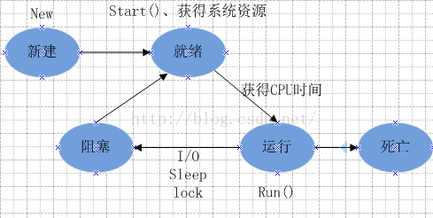

基本概念详解之五——什么是线程

引言

线程，又称为轻量进程(Lightweight Process，LWP），是程序执行流的最小单元， 是被系统独立调度和分派的基本单位。

标准的线程组成：  线程ID，当前指令指针(PC），寄存器集合和堆栈。

线程是进程中的一个实体，线程自己不拥有系统资源，只拥有一点儿在运行中必不可少的资源，但它可与同属一个进程的其它线程共享进程所拥有的全部资源。

一个线程可以创建和撤消另一个线程，同一进程中的多个线程之间可以并发执行。由于线程之间的相互制约，致使线程在运行中呈现出间断性。

线程也有就绪、阻塞和运行三种基本状态。就绪状态是指线程具备运行的所有条件，逻辑上可以运行，在等待处理机；运行状态是指线程占有处理机正在运行；阻塞状态是指线程在等待一个事件（如某个信号量），逻辑上不可执行。每一个程序都至少有一个线程，若程序只有一个线程，那就是程序本身。

线程是程序中一个单一的顺序控制流程。进程内有一个相对独立的、可调度的执行单元，是系统独立调度和分派CPU的基本单位指令运行时的程序的调度单位。在单个程序中同时运行多个线程完成不同的工作，称为多线程。

线程的特点

在多线程OS中，通常是在一个进程中包括多个线程，每个线程都是作为利用CPU的基本单位，是花费最小开销的实体。线程具有以下属性。

1）轻型实体
线程中的实体基本上不拥有系统资源，只是有一点必不可少的、能保证独立运行的资源。
线程的实体包括程序、数据和TCB。线程是动态概念，它的动态特性由线程控制块TCB（Thread Control Block）描述。TCB包括以下信息：
（1）线程状态。
（2）当线程不运行时，被保存的现场资源。
（3）一组执行堆栈。
（4）存放每个线程的局部变量主存区。
（5）访问同一个进程中的主存和其它资源。
用于指示被执行指令序列的程序计数器、保留局部变量、少数状态参数和返回地址等的一组寄存器和堆栈。

2）独立调度和分派的基本单位。
通常在一个进程中可以包含若干个线程，它们可以利用进程所拥有的资源，在引入线程的操作系统中，通常都是把进程作为分配资源的基本单位，而把线程作为独立运行和独立调度的基本单位，由于线程比进程更小，基本上不拥有系统资源，故对它的调度所付出的开销就会小得多，能更高效的提高系统内多个程序间并发执行的程度。
在多线程OS中，线程是能独立运行的基本单位，因而是独立调度和分派的基本单位。由于线程很“轻”，故线程的切换非常迅速且开销小（在同一进程中的）。

3）可并发执行。
在一个进程中的多个线程之间，可以并发执行，甚至允许在一个进程中所有线程都能并发执行；同样，不同进程中的线程也能并发执行，充分利用和发
了处理机与外围设备并行工作的能力。
对于一些要求同时进行并且又要共享某些变量的并发操作，只能用线程，不能用进程。
在多CPU系统中使用多线程更加有效，操作系统会保证当线程数不大于CPU数目时，不同的线程运行于不同的CPU上。
改善程序结构.一个既长又复杂的进程可以考虑分为多个线程，成为几个独立或半独立的运行部分，这样的程序会利于理解和修改。

4）共享进程资源。
在同一进程中的各个线程，都可以共享该进程所拥有的资源，这首先表现在：所有线程都具有相同的地址空间（进程的地址空间），这意味着，线程可以访问该地址空间的每一个虚地址；此外，还可以访问进程所拥有的已打开文件、定时器、信号量机构等。由于同一个进程内的线程共享内存和文件，所以线程之间互相通信不必调用内核。
线程间通信非常方便，对不同进程来说，它们具有独立的数据空间，要进行数据的传递只能通过进程间通信的方式进行，这种方式不仅费时，而且很不方便。线程则不然，由于同一进程下的线程之间共享数据空间，所以一个线程的数据可以直接为其它线程所用，这不仅快捷，而且方便。

5）线程间的非独立性
进程有独立的地址空间，一个进程崩溃后，在保护模式下不会对其它进程产生影响，而线程只是一个进程中的不同执行流程。 
线程有自己的堆栈和局部变量，但线程没有单独的地址空间，一个线程死掉就等于整个进程死掉，所以多进程的程序要比多线程的程序健壮，但在进程切换时，耗费资源较大，效率要差一些。

线程运行的状态

线程从创建、运行到结束总是处于下面五个状态之一：新建状态、就绪状态、运行状态、阻塞状态及死亡状态。

1.新建状态

当用new操作符创建一个线程时，此时程序还没有开始运行线程中的代码。

2.就绪状态

一个新创建的线程并不自动开始运行，要执行线程，必须调用线程的start()方法。当线程对象调用start()方法即启动了线程，start()方法创建线程运行的系统资源，并调度线程运行run()方法。当start()方法返回后，线程就处于就绪状态。

处于就绪状态的线程并不一定立即运行run()方法，线程还必须同其他线程竞争CPU时间，只有获得CPU时间才可以运行线程。因为在单CPU的计算机系统中，不可能同时运行多个线程，一个时刻仅有一个线程处于运行状态。因此此时可能有多个线程处于就绪状态。对多个处于就绪状态的线程是由Java运行时系统的线程调度程序来调度的。

3.运行状态（running）

当线程获得CPU时间后，它才进入运行状态，真正开始执行run()方法。

4.阻塞状态（blocked）

线程运行过程中，可能由于各种原因进入阻塞状态：

①线程通过调用sleep方法进入睡眠状态；

②线程调用一个在I/O上被阻塞的操作，即该操作在输入输出操作完成之前不会返回到它的调用者；

③线程试图得到一个锁，而该锁正被其他线程持有；

④线程在等待某个触发条件；

所谓阻塞状态是正在运行的线程没有运行结束，暂时让出CPU，这时其他处于就绪状态的线程就可以获得CPU时间，进入运行状态。

5.死亡状态（dead）

有两个原因会导致线程死亡：

①run方法正常退出而自然死亡；

②一个未捕获的异常终止了run方法而使线程猝死；

为了确定线程在当前是否存活着（就是要么是可运行的，要么是被阻塞了），需要使用isAlive方法，如果是可运行或被阻塞，这个方法返回true；如果线程仍旧是new状态且不是可运行的，或者线程死亡了，则返回false。

线程和进程的区别

线程与进程的区别可以归纳为以下4点：

1）地址空间和其它资源（如打开文件）： 进程间相互独立，同一进程的各线程间共享。某进程内的线程在其它进程不可见。

2）通信： 进程间通信IPC，线程间可以直接读写进程数据段（如全局变量）来进行通信——需要进程同步和互斥手段的辅助，以保证数据的一致性。

3）调度和切换： 线程上下文切换比进程上下文切换要快得多。

4）可执行性： 在多线程OS中，线程不是一个可执行的实体。

5）创建流程： 进程是独立的，每创建一个进程时，都要有它自己的pcb，地址空间，页表和物理内存。但是创建线程时就不必这么繁琐，只需创建自己的pcb即可。

6）单元性： 进程是承担分配系统资源的基本实体，线程是操作系统或进程调度的最小单位。

7）独立性： 进程有独立的地址空间，一个进程崩溃后，不会对别的进程产生影响。而线程之间没有单独的地址空间，一个线程挂掉就等于整个进程挂掉。

参考附录

进程和线程的概念、区别和联系        https://www.cnblogs.com/reality-soul/p/6397021.html

王涵的博客  https://blog.csdn.net/daoshuti/article/details/55051936  思维导图有道云下载   https://note.youdao.com/share/?id=cf06efe616c1a3eca2d631a9c0d88a98&type=note#/

线程——百度百科
https://baike.baidu.com/item/%E7%BA%BF%E7%A8%8B/103101?fr=aladdin

线程的五大状态
https://blog.csdn.net/hellorichen/article/details/52839396