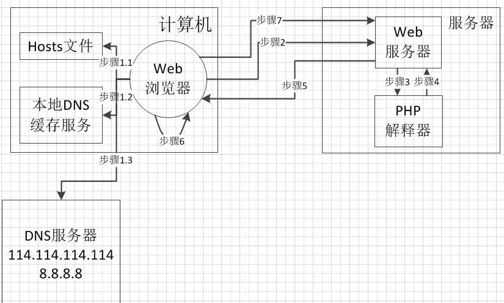

# 详解Http请求流程 #

----------

> 注意： 本文主要写给基础薄弱的同学，尽量不引入太多概念，只着重Http请求的流程， 如有不当之处，还请指正。

> [访问源站](http://www.araryun.com "访问源站")

> [原创不易，转载请注明](http://www.araryun.com "原创不易，转载请注明")

----------

从输入URL访问php文件到浏览器展示内容的详细过程？

在浏览器中输入http://www.test.com/test.php ，访问服务器上的一个叫test.php的文件，文件内容如下：

    <?php
    			echo "Hello，world！";
    ?>

正常访问完成后，会在浏览器中看到Hello，world！，参与该过程的主要有以下5个对象：
1. 浏览器（Http客户端），2. 本地DNS解析服务， 3. DNS服务器， 4. Web服务器（httpd、nginx等），5. PHP解释器

访问的整个流程如下所示：

	1. 浏览器解析URL中的域名，获取服务器的IP地址和端口号
	2. 浏览器与Web服务器建立连接，构造Http请求Request，向Web服务器发送生成的Http请求
	3. Web服务器接收到请求后，解析Http请求Request，并调用PHP解释器执行相应的操作
	4. PHP解释器解析相应的脚本内容，并将结果返回给Web服务器
	5. Web服务器将收到的内容生成Http响应Response，并返回给浏览器
	6. 浏览器接收到Http请求的响应Response，将页面内容HTML展示出来
	7. 浏览器发送请求获取嵌入在HTML中的资源

一、浏览器解析URL中的域名，获取服务器的IP地址和端口号

1. 发起请求，浏览器先解析URL中的域名，一般来说，浏览器会首先查看本地硬盘的 hosts 文件，看看其中有没有和这个域名对应的规则，如果有的话就直接使用 hosts 文件里面的 ip 地址，hosts文件，在Linux系统中位于/etc/hosts，在Windows系统中位于C:\Windows\System32\drivers\etc\hosts。

2. 如果在本地的 hosts 文件没有能够找到对应的 ip 地址，浏览器会询问本地DNS缓存服务，如果本地DNS缓存服务没有找到，浏览器则向DNS服务器发送查询请求DNS服务器一般是你的网络接入服务器商（ISP）提供，比如中国电信、联通和移动，也可以使用公共域名解析服务器114.114.114.114或Google提供的8.8.8.8；

浏览器最终需要获取到服务器的IP以及端口，例如输入的域名是test.com， 发送的是http请求，若不指定端口号则使用默认的端口80，即完整的请求是test.com:80，如果Web服务器使用的端口是8080，则访问的请求URL应该为http://www.test.com:8080/test.php 

二、浏览器与Web服务器建立连接，构造Http请求Request，向Web服务器发送生成的Http请求

浏览器获取IP地址和端口之后，浏览器会以一个随机端口（1024<端口<65535）向服务器的Web服务器的端口（默认是80端口）发起TCP的连接请求。这个连接请求到达服务器端后（这中间通过各种路由设备，局域网内除外），进入到网卡，然后是进入到内核的TCP/IP协议栈（用于识别该连接请求，解封包，一层一层的剥开），还有可能要经过防火墙（属于内核的模块）的过滤，最终到达Web服务器，最终建立了TCP/IP的连接；

建立了TCP连接之后，浏览器会生成并发起一个http请求，一个典型的 http request header 一般需要包括请求的方法，例如 GET 或者 POST 等，不常用的还有 PUT 和 DELETE 、HEAD、OPTION以及 TRACE 方法，一般的浏览器只能发起 GET 或者 POST 请求。

客户端向服务器发起http请求的时候，会有一些请求信息，请求信息包含三个部分：

1. 开始行：  请求方法URI协议/版本

 2. 请求头(Request Header)： 键值对形式的相关请求参数

3. 请求正文：  请求正文参数，可以没有，请求头和请求正文之间有一个空行，标志请求头已经结束

下面是HTTP请求参数：

	开始行：  
	GET /test.php HTTP/1.1
	
	请求头：
	Host: www.test.com
	Connection: keep-alive
	Upgrade-Insecure-Requests: 1
	User-Agent: Mozilla/5.0 (Windows NT 6.1; WOW64) AppleWebKit/537.36 (KHTML, like Gecko) Chrome/58.0.3029.110 Safari/537.36 SE 2.X MetaSr 1.0
	Accept: text/html,application/xhtml+xml,application/xml;q=0.9,image/webp,*/*;q=0.8
	Accept-Encoding: gzip, deflate, sdch, br
	Accept-Language: zh-CN,zh;q=0.8
	
	无请求正文

三. Web服务器接收到请求后，解析Http请求Request，并调用PHP解释器执行相应的操作

Web服务器对接收到的Http请求报文进行解析，根据方法，资源，首部和可选的主体部分对请求进行处理，如访问http://test.com/test.php ，默认情况下，Web服务器会调用PHP解释器去解释test.com网站根目录下的test.php文件。

四. PHP解释器解析相应的脚本内容，并将结果返回给Web服务器

PHP解释器根据输入的脚本文件位置，读取该脚本文件，解释并执行该php脚本文件，解释一行执行一行，并将最终生成的结果返回给Web服务器

五. Web服务器将收到的内容生成Http响应Response，并返回给浏览器

Web服务器获取PHP解释器返回的结果，并将结果封装成Http响应Response，通过之前建立的TCP/IP连接，将该Response返回给浏览器

六、浏览器接收到Http请求的响应Response，将页面内容HTML展示出来

浏览器在接收到Http请求返回的响应Response后，浏览器会解析返回的文件中的HTML标签，并显示对应的内容。

七、 浏览器发送请求获取嵌入在HTML中的资源

如果HTML标签中包含其他的超链接，如图片、音频、视频、CSS、JS等等，浏览器会发送一个获取请求来重新获得这些文件，比如需要获取外图片，CSS，JS文件等，类似于下面的链接：

	图片文件：			http://www.test.com/imgs/test.jpeg
	CSS式样表：			http://www.test.com/css/test.css
	JavaScript 文件：	http://www.test.com/js/test.js

这些地址都要经历一个和访问PHP文件读取类似的过程，浏览器会在DNS中查找这些域名，发送请求，由于访问的都是静态文件，Web服务器不会再调用PHP解释器去干活了，而是直接读取访问的静态文件，并将该文件返回给浏览器。

【导航篇】从输入域名到展示网页，我们都做了什么？  https://www.90.cx/init-website/

HTTP协议详解以及URL具体访问过程  http://www.cnblogs.com/phpstudy2015-6/p/6810130.html

http服务详解（1）——一次完整的http服务请求处理过程   https://www.cnblogs.com/along21/p/7691234.html

一次完整的HTTP请求过程   https://blog.csdn.net/yezitoo/article/details/78193794

一次完整的HTTP事务过程分析   https://blog.csdn.net/xianymo/article/details/46785391

【原】老生常谈-从输入url到页面展示到底发生了什么       http://www.cnblogs.com/xianyulaodi/p/6547807.html

为什么修改hosts不立即生效？--浏览器DNS缓存机制分析   https://my.oschina.net/flashsword/blog/99068