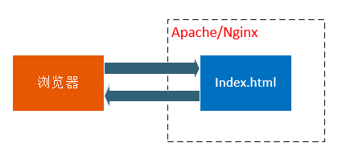
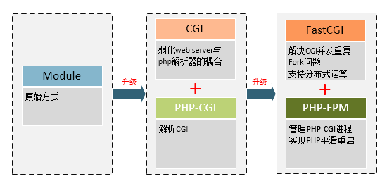

# 详解Apache的MPM及常用的PHP模式 #

----------

> 注意： 本文主要介绍了Apache多处理模块，以及Apache常用的PHP模式。

> [访问源站](http://www.araryun.com "访问源站")

> [转载请注明](http://www.araryun.com "转载请注明")

----------

## Apache的多处理模块MPM ##

Apache HTTP 服务器被设计为一个功能强大，并且灵活的 web 服务器， 可以在很多平台与环境中工作。不同平台和不同的环境往往需要不同 的特性，或可能以不同的方式实现相同的特性最有效率。Apache 通过模块化的设计来适应各种环境。这种设计允许网站管理员通过在 编译时或运行时，选择哪些模块将会加载在服务器中，来选择服务器特性。

Apache 2.0 扩展此模块化设计到最基本的 web 服务器功能。 它提供了可以选择的多处理模块(MPM)，用来绑定到网络端口上，接受请求， 以及调度子进程处理请求。

扩展到这一级别的服务器模块化设计，带来两个重要的好处:

Apache 能更优雅，更高效率的支持不同的平台。尤其是 Apache 的 Windows 版本现在更有效率了，因为 mpm_winnt 能使用原生网络特性取代在 Apache 1.3 中使用的 POSIX 层。它也可以扩展到其它平台 来使用专用的 MPM。

Apache 能更好的为有特殊要求的站点定制。例如，要求 更高伸缩性的站点可以选择使用线程的 MPM，即 worker 或 event； 需要可靠性或者与旧软件兼容的站点可以使用 prefork。

在用户看来，MPM 很像其它 Apache 模块。主要是区别是，在任何时间， 必须有一个，而且只有一个 MPM 加载到服务器中。可用的 MPM 列表位于 模块索引页面（http://httpd.apache.org/docs/2.2/mod/）。

## 选择 MPM ##

MPM 必须在编译之前，配置时指定，然后编译到服务器程序中。 仅当编译器知道使用了线程时，它才有能力优化许多函数。

为了使用指定的 MPM，请在执行 configure 时，使用参数 --with-mpm=NAME。NAME 是指定的 MPM 名称。

编译完成后，可以使用 ./httpd -l 来确定选择的 MPM。 此命令会列出编译到服务器程序中的所有模块，包括 MPM。

## 默认 MPM ##

下表列出了不同系统的默认 MPM。如果你不在编译时选择，那么它就是你将要使用的 MPM。

BeOS	beos
Netware	mpm_netware
OS/2	mpmt_os2
Unix	prefork
Windows	mpm_winnt

常见的MPM模块有以下几种：

beos

This Multi-Processing Module is optimized for BeOS.

event

An experimental variant of the standard worker MPM

mpm_netware

Multi-Processing Module implementing an exclusively threaded web server optimized for Novell NetWare

mpmt_os2

Hybrid multi-process, multi-threaded MPM for OS/2

prefork

Implements a non-threaded, pre-forking web server

mpm_winnt

This Multi-Processing Module is optimized for Windows NT.

worker

Multi-Processing Module implementing a hybrid multi-threaded multi-process web server

## Linux上Apache支持的三种MPM模式 ##

Apache2.4.25总共支持三种MPM（多进程处理模块）模式，分别是Prefork、worker及event，这三种模式代表了Apache的演变和发展。

Apache2.2中，默认启用prefork模式，同时引进了实验性质的event模式；

Apache2.4中，正式支持并且默认使用了event模式。并且可以在编译的时候增加了选项enable-mpms-shared来编译MPM并在编译后可以动态加载。

可以通过apachectl -V查看当前Apache的工作模式，比如在Apache2.2.31上查看：

	Server version: Apache/2.2.31 (Unix)  
	Server built:   Dec 25 2016 07:02:07  
	Server's Module Magic Number: 20051115:40  
	Server loaded:  APR 1.5.2, APR-Util 1.5.4  
	Compiled using: APR 1.5.2, APR-Util 1.5.4  
	Architecture:   64-bit  
	Server MPM:     Prefork  
	  threaded:     no  
	    forked:     yes (variable process count)  

在Apache2.4.25上查看：

	$ /usr/local/apache24/bin/httpd -V  
	Server version: Apache/2.4.18 (Unix)  
	Server built:   Feb 18 2016 02:28:26  
	Server's Module Magic Number: 20120211:52  
	Server loaded:  APR 1.5.2, APR-UTIL 1.5.4  
	Compiled using: APR 1.5.2, APR-UTIL 1.5.4  
	Architecture:   64-bit  
	Server MPM:     event  
	  threaded:     yes (fixed thread count)  
	    forked:     yes (variable process count)  

## Prefork MPM详解 ##

Prefork MPM实现了一个非线程、预派生的工作模式。它在Apache启动之初，就会预派生一些子进程，然后等待连接。可以减少频繁创建和销毁进程的开销，每个子进程只有一个线程。它成熟稳定，可以兼容新老模块，也不需要担心线程安全问题。但是一个进程相对地占用更多的资源，消耗大量内存，不擅长处理高并发的场景。

	<IfModule mpm_prefork_module>  
	    StartServers          5  
	    MinSpareServers       5  
	    MaxSpareServers      10  
	    MaxClients          150  
	    MaxRequestsPerChild   0  
	</IfModule> 

MaxClients设定Apache可同时处理的请求数量，其对Apache性能的影响非常打。默认的150远远不能满足一般站点(ps -ef | grep httpd | wc -l)，超过这个数量的请求需要排队，直到前面的请求处理完毕。如果我们发现系统资源还剩很多，但是HTTP访问却很缓慢，大多数时候增加这个值可以得到缓解。
这个值的计算公式可以参考：

apache_max_process_with_good_perfermance < (total_hardware_memory / apache_memory_per_process ) * 2 ；

apache_max_process = apache_max_process_with_good_perfermance * 1.5 ；

其中httpd平均占用内存：

ps aux|grep -v grep|awk '/httpd/{sum+=$6;n++};END{print sum/n}'
MaxRequestsPerChild这个值的含义是处理多少个请求后该进程自动销毁，默认值0意味着永不销毁。当负载较高时，为了使每个进程处理更多的请求，避免销毁、创建进程的开销，一般建议设置为0或较大的数字。但是也要注意可能会造成进程占用的内存不能得到释放，所以这个值不能设置得太大，也不能太小，大了会影响资源的释放，小了会导致Apache不断地fork进程。

建议值：1分钟pv（访问量）/MaxClients

## worker MPM详解 ##

与Prefork工作模式相比，worker使用了多进程和多线程的混合模式，worker模式也同样会预派生一些子进程，然后每个子进程创建一些线程，同时包括一个监听线程，每个请求过来会被分配到一个线程来服务。线程比进程更加轻量级，因为线程通常会共享父进程的内存地址的，因此内存占用会减少一些。

同时如果一个线程异常挂了，会导致父进程和它的其他正常子线程都挂了，这样也只会影响Apache的一部分，而不是整个服务。

缺点使必须考虑线程安全性，因为多个子进程是共享父进程的内存地址的。如果使用keep-alive的长连接方式，某个线程会被一直占据，也许中间没有任何请求，需要等到超时才会被释放。如果过多的线程被这样占据，也会导致在高并发下的无服务线程可用。

## event MPM详解 ##

和worker工作模式很像，最大的区别是解决了在keep-alive场景下，长期被占用的线程的资源浪费问题，在event MPM中，会有一个专门的线程来管理这些keep-alive线程，当有真实请求过来的时候，将请求传递给服务线程，执行完毕后，又允许它释放，这样增强了在高并发场景下的请求处理能力。

## Apache采用的PHP模式 ##

在搭建 LAMP/LNMP 服务器时，会经常遇到 PHP-FPM、FastCGI和CGI 这几个概念。如果对它们一知半解，很难搭建出高性能的服务器，接下来我们就以图形方式，解释这些概念之间的关系。

基础
在整个网站架构中，Web Server（如Apache）只是内容的分发者。举个栗子，如果客户端请求的是 index.html，那么Web Server会去文件系统中找到这个文件，发送给浏览器，这里分发的是静态数据。

如果请求的是 index.php，根据配置文件，Web Server知道这个不是静态文件，需要去找 PHP 解析器来处理，那么他会把这个请求简单处理，然后交给PHP解析器。

当Web Server收到 index.php 这个请求后，会启动对应的 CGI 程序，这里就是PHP的解析器。接下来PHP解析器会解析php.ini文件，初始化执行环境，然后处理请求，再以规定CGI规定的格式返回处理后的结果，退出进程，Web server再把结果返回给浏览器。这就是一个完整的动态PHP Web访问流程，接下来再引出这些概念，就好理解多了，

CGI：是 Web Server 与 Web Application 之间数据交换的一种协议。

FastCGI：同 CGI，是一种通信协议，但比 CGI 在效率上做了一些优化。同样，SCGI 协议与 FastCGI 类似。
PHP-CGI：是 PHP （Web Application）对 Web Server 提供的 CGI 协议的接口程序。
PHP-FPM：是 PHP（Web Application）对 Web Server 提供的 FastCGI 协议的接口程序，额外还提供了相对智能一些任务管理。
WEB 中，

Web Server 一般指Apache、Nginx、IIS、Lighttpd、Tomcat等服务器，
Web Application 一般指PHP、Java、Asp.net等应用程序。

## Module方式 ##

在了解 CGI 之前，我们先了解一下Web server 传递数据的另外一种方法：PHP Module加载方式。以 Apache 为例，在PHP Module方式中，是不是在 Apache 的配置文件 httpd.conf 中加上这样几句：

	# 加入以下2句
	LoadModule php5_module D:/php/php5apache2_2.dll
	AddType application/x-httpd-php .php
	
	# 修改如下内容
	<IfModule dir_module>
	    DirectoryIndex index.php index.html
	</IfModule>

上面是 Windows 下安装php和apache环境后手动配置，在linux下源码安装大致是这样配置的：

	# ./configure --with-mysql=/usr/local --with-apache=/usr/local/apache --enable-track-vars

所以，这种方式，他们的共同本质都是用 LoadModule 来加载 php5_module，就是把php作为apache的一个子模块来运行。当通过web访问php文件时，apache就会调用php5_module来解析php代码。

那么php5_module是怎么来将数据传给php解析器来解析php代码的呢？答案是通过sapi。

我们再来看一张图，详细的说说apache 与 php 与 sapi的关系：

从上面图中，我们看出了sapi就是这样的一个中间过程，SAPI提供了一个和外部通信的接口，有点类似于socket，使得PHP可以和其他应用进行交互数据（apache，nginx等）。php默认提供了很多种SAPI，常见的提供给apache和nginx的php5_module、CGI、FastCGI，给IIS的ISAPI，以及Shell的CLI。

所以，以上的apache调用php执行的过程如下：

apache -> httpd -> php5_module -> sapi -> php
好了。apache与php通过php5_module的方式就搞清楚了吧！

这种模式将php模块安装到apache中，所以每一次apache结束请求，都会产生一条进程，这个进程就完整的包括php的各种运算计算等操作。

在上图中，我们很清晰的可以看到，apache每接收一个请求，都会产生一个进程来连接php通过sapi来完成请求，可想而知，如果一旦用户过多，并发数过多，服务器就会承受不住了。

而且，把mod_php编进apache时，出问题时很难定位是php的问题还是apache的问题。

## CGI ##

CGI（Common Gateway Interface）全称是“通用网关接口”，WEB 服务器与PHP应用进行“交谈”的一种工具，其程序须运行在网络服务器上。CGI可以用任何一种语言编写，只要这种语言具有标准输入、输出和环境变量。如php、perl、tcl等。

WEB服务器会传哪些数据给PHP解析器呢？URL、查询字符串、POST数据、HTTP header都会有。所以，CGI就是规定要传哪些数据，以什么样的格式传递给后方处理这个请求的协议。仔细想想，你在PHP代码中使用的用户从哪里来的。

也就是说，CGI就是专门用来和 web 服务器打交道的。web服务器收到用户请求，就会把请求提交给cgi程序（如php-cgi），cgi程序根据请求提交的参数作应处理（解析php），然后输出标准的html语句，返回给web服服务器，WEB服务器再返回给客户端，这就是普通cgi的工作原理。

CGI的好处就是完全独立于任何服务器，仅仅是做为中间分子。提供接口给apache和php。他们通过cgi搭线来完成数据传递。这样做的好处了尽量减少2个的关联，使他们2变得更独立。

但是CGI有个蛋疼的地方，就是每一次web请求都会有启动和退出过程，也就是最为人诟病的fork-and-execute模式，这样一在大规模并发下，就死翘翘了。

## FastCGI介绍 ##

FastCGI简单介绍
从根本上来说，FastCGI是用来提高CGI程序性能的。类似于CGI，FastCGI也可以说是一种协议。

FastCGI像是一个常驻(long-live)型的CGI，它可以一直执行着，只要激活后，不会每次都要花费时间去fork一次。它还支持分布式的运算, 即 FastCGI 程序可以在网站服务器以外的主机上执行，并且接受来自其它网站服务器来的请求。

FastCGI是语言无关的、可伸缩架构的CGI开放扩展，其主要行为是将CGI解释器进程保持在内存中，并因此获得较高的性能。众所周知，CGI解释器的反复加载是CGI性能低下的主要原因，如果CGI解释器保持在内存中，并接受FastCGI进程管理器调度，则可以提供良好的性能、伸缩性、Fail- Over特性等等。

FastCGI的工作原理
FastCGI接口方式采用C/S结构，可以将HTTP服务器和脚本解析服务器分开，同时在脚本解析服务器上启动一个或者多个脚本解析守护进程。当HTTP服务器每次遇到动态程序时，可以将其直接交付给FastCGI进程来执行，然后将得到的结果返回给浏览器。这种方式可以让HTTP服务器专一地处理静态请求，或者将动态脚本服务器的结果返回给客户端，这在很大程度上提高了整个应用系统的性能。

Web Server启动时载入FastCGI进程管理器（Apache Module或IIS ISAPI等)
FastCGI进程管理器自身初始化，启动多个CGI解释器进程(可建多个php-cgi)，并等待来自Web Server的连接。
当客户端请求到达Web Server时，FastCGI进程管理器选择并连接到一个CGI解释器。Web server将CGI环境变量和标准输入发送到FastCGI子进程php-cgi。
FastCGI子进程完成处理后，将标准输出和错误信息从同一连接返回Web Server。当FastCGI子进程关闭连接时，请求便告处理完成。FastCGI子进程接着等待，并处理来自FastCGI进程管理器(运行在Web Server中)的下一个连接。 在CGI模式中，php-cgi在此便退出了。
FastCGI与CGI特点：

对于CGI来说，每一个Web请求PHP都必须重新解析php.ini、重新载入全部扩展，并重新初始化全部数据结构。而使用FastCGI，所有这些都只在进程启动时发生一次。一个额外的好处是，持续数据库连接(Persistent database connection)可以工作。
由于FastCGI是多进程，所以比CGI多线程消耗更多的服务器内存，php-cgi解释器每进程消耗7至25兆内存，将这个数字乘以50或100就是很大的内存数。

## PHP-FPM介绍 ##

要了解PHP-FPM，就得先说说PHP-CGI。

PHP-CGI就是PHP实现的自带的FastCGI管理器。 虽然是php官方出品，但是这丫的却一点也不给力，性能太差，而且也很麻烦不人性化，主要体现在：

php-cgi变更php.ini配置后，需重启php-cgi才能让新的php-ini生效，不可以平滑重启。
直接杀死php-cgi进程，php就不能运行了。
上面2个问题，一直让很多人病垢了很久，所以很多人一直还是在用 Module 方式。 直到 2004年一个叫 Andrei Nigmatulin的屌丝发明了PHP-FPM ，这神器的出现就彻底打破了这种局面，这是一个PHP专用的 fastcgi 管理器，它很爽的克服了上面2个问题，而且，还表现在其他方面更表现强劲。

也就是说，PHP-FPM 是对于 FastCGI 协议的具体实现，他负责管理一个进程池，来处理来自Web服务器的请求。目前，PHP5.3版本之后，PHP-FPM是内置于PHP的。

因为PHP-CGI只是个CGI程序，他自己本身只能解析请求，返回结果，不会进程管理。所以就出现了一些能够调度 php-cgi 进程的程序，比如说由lighthttpd分离出来的spawn-fcgi。同样，PHP-FPM也是用于调度管理PHP解析器php-cgi的管理程序。

PHP-FPM通过生成新的子进程可以实现php.ini修改后的平滑重启。

总结
最后，我们来总结一下，这些技术经过不断的升级，可以解决什么问题（不然也不会升级嘛）,所以，如果要搭建一个高性能的PHP WEB服务器，目前最佳的方式是Apache/Nginx + FastCGI + PHP-FPM(+PHP-CGI)方式了，不要再使用 Module加载或者 CGI 方式）

## 重点资料 ##

多处理模块(MPM)   http://httpd.apache.org/docs/2.2/mpm.html

CGI、FastCGI和PHP-FPM关系图解    https://www.awaimai.com/371.html

Apache性能优化之MPM选择和配置   https://blog.csdn.net/ccscu/article/details/70182476

[好文]mod_php和mod_fastcgi和php-fpm的介绍,对比,和性能数据    https://wenku.baidu.com/view/887de969561252d380eb6e92.html

