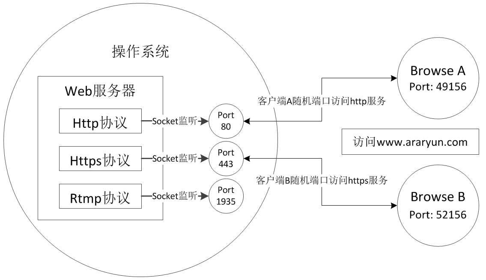

基本概念详解之二————端口、Socket、协议和网络程序

端口的定义

"端口"是英文port的意译，可以认为是设备与外界通讯交流的出口。端口可分为虚拟端口和物理端口，其中虚拟端口指计算机内部或交换机路由器内的端口，不可见。例如计算机中的80端口、21端口、23端口等。物理端口又称为接口，是可见端口，计算机背板的RJ45网口，交换机路由器集线器等RJ45端口。电话使用RJ11插口也属于物理端口的范畴。

下文描述的端口均指的是计算机的虚拟端口，特指TCP/UDP协议中的端口，端口是传输层TCP/UDP协议的标志。

计算机中为什么会有端口？

一台拥有IP地址的主机可以提供许多服务，比如Web服务、FTP服务、SMTP服务等，这些服务完全可以通过1个IP地址来实现。那么，主机是怎样区分不同的网络服务呢？显然不能只靠IP地址，因为IP 地址与网络服务的关系是一对多的关系。实际上是通过“IP地址+端口号”来区分不同的服务的。
需要注意的是，端口并不是一一对应的。比如你的电脑作为客户机访 问一台WWW服务器时，WWW服务器使用“80”端口与你的电脑通信，但你的电脑则可能使用“3457”这样的端口。

在Internet上，各主机间通过TCP/IP协议发送和接收数据包，各个数据包根据其目的主机的ip地址来进行互联网络中的路由选择,把数据包顺利的传送到目的主机。大多数操作系统都支持多程序（进程）同时运行，那么目的主机应该把接收到的数据包传送给众多同时运行的进程中的哪一个呢？显然这个问题有待解决，端口机制便由此被引入进来。

本地操作系统会给那些有需求的进程分配协议端口（protocol port，即我们常说的端口），每个协议端口由一个正整数标识，如：80，139，445，等等。当目的主机接收到数据包后，将根据报文首部的目的端口号，把数据发送到相应端口，而与此端口相对应的那个进程将会领取数据并等待下一组数据的到来。说到这里，端口的概念似乎仍然抽象，那么继续跟我来，别走开。

端口的本质可以看做是网络数据队列的标识符，操作系统为各个进程分配了不同的队列，数据包按照目的端口被推入相应的队列中，等待被进程取用，在极特殊的情况下，这个队列也是有可能溢出的，不过操作系统允许各进程指定和调整自己的队列的大小。

不光接受数据包的进程需要开启它自己的端口，发送数据包的进程也需要开启端口，这样，数据包中将会标识有源端口，以便接受方能顺利地回传数据包到这个端口。

端口分类

如果把IP地址比作一间房子 ，端口就是出入这间房子的门。真正的房子只有几个门，但是一个IP地址的端口可以有65536（即：2^16）个之多！端口是通过端口号来标记的，端口号只有整数，范围是从0 到65535（2^16-1）。

按照使用端口的传输协议，端口类型主要分为TCP端口、UDP端口。

TCP端口
TCP： Transmission Control Protocol传输控制协议，TCP是一种面向连接（连接导向）的、可靠的、基于字节流的传输层（Transport layer）通信协议，由IETF的RFC 793说明（specified）。在简化的计算机网络OSI模型中，它完成第四层传输层所指定的功能，UDP是同一层内另一个重要的传输协议。

UDP端口
UDP :  User Datagram Protocol用户数据报协议，UDP是OSI参考模型中一种无连接的传输层协议，提供面向事务的简单不可靠信息传送服务。UDP 协议基本上是IP协议与上层协议的接口。UDP协议适用端口分别运行在同一台设备上的多个应用程序。

由于TCP和UDP 两个协议是独立的，因此各自的端口号也相互独立，比如TCP有235端口，UDP也 可以有235端口，两者并不冲突。

按照端口编号0~65535，端口类型主要分为三类： 周知端口、动态端口、注册端口

1.周知端口（Well Known Ports）

周知端口是众所周知的端口号，范围从0到1023，其中80端口分配给WWW服务，21端口分配给FTP服务等。我们在IE的地址栏里输入一个网址的时候是不必指定端口号的，因为在默认情况下WWW服务的端口是“80”。

网络服务是可以使用其他端口号的，如果不是默认的端口号则应该在 地址栏上指定端口号，方法是在地址后面加上冒号“：”（半角），再加上端口号。比如使用“8080”作为WWW服务的端口，则需要在地址栏里输入“网址：8080”。

但是有些系统协议使用固定的端口号，它是不能被改变的，比如139 端口专门用于NetBIOS与TCP/IP之间的通信，不能手动改变。

2.动态端口（Dynamic Ports）
动态端口的范围是从49152到65535。之所以称为动态端口，是因为它 一般不固定分配某种服务，而是动态分配。

3.注册端口
端口1024到49151，分配给用户进程或应用程序。这些进程主要是用户选择安装的一些应用程序，而不是已经分配好了公认端口的常用程序。这些端口在没有被服务器资源占用的时候，可以用用户端动态选用为源端口。

按照数据传递的方向可以分为： 源端口和目的端口

源端口就是指本地端口，目的端口就是远程端口
比如通过浏览器访问远端Http服务器，浏览器发送请求使用的端口，就是源端口，而Http服务器监听的80端口就是目的端口

Socket是什么

1. Socket又称"套接字"，网络上的两个程序通过一个双向的通信连接实现数据的交换，这个连接的一端称为一个socket

2. Socket不是一个通信协议，是应用层与传输层之间沟通的桥梁，Socket向下是对传输层TCP/UDP协议的封装，向上是对应用层提供数据接口

3. Socket的最终功能实现是由操作系统完成的，socket本质是编程接口(API)，对TCP/IP的封装，是操作系统为应用程序提供的网络操作接口，通过socket，应用程序可以访问到传输层TCP/UDP协议,建立网络通信连接至少要一对端口号(socket)

Socket的特点

1. 每一个Socket都有三个特征唯一确定：协议(TCP/UDP)，IP地址(0.0.0.0/127.0.0.1等)，本地端口(80/443等)。

2. 一个完整的Socket有一个本地唯一的Socket号，由操作系统分配。

3. Socket是面向客户/服务器模型而设计的，针对客户和服务器程序提供不同的Socket系统调用。以浏览器访问Web服务器为例，浏览器创建一个  Socket，随机申请一个端口，服务器的Socket使用80端口，任何客户都可以向它发出连接请求和信息请求。

4. Socket利用客户/服务器模式巧妙地解决了进程之间建立通信连接的问题，socket通信属于进程间通信(同机器下的不同进程)的一种方式

5. 一个Socket连接，都是由两个Socket组成的，一个称为socket客户端，一个称为socket服务端，每个socket连接都具备唯一的四元组标志： 源IP:源port——>目的IP:目的port

Socket连接过程

套接字之间的连接过程可以分为三个步骤：   服务器监听，客户端请求，连接确认。

（1）服务器监听：是服务器端套接字并不定位具体的客户端套接字，而是处于等待连接的状态，实时监控网络状态。

（2）客户端请求：是指由客户端的套接字提出连接请求，要连接的目标是服务器端的套接字。为此，客户端的套接字必须首先描述它要连接的服务器的套接字，指出服务器端套接字的地址和端口号，然后就向服务器端套接字提出连接请求。

（3）连接确认：是指当服务器端套接字监听到或者说接收到客户端套接字的连接请求，它就响应客户端套接字的请求，建立一个新的线程，把服务器端套接字的描述发给客户端，一旦客户端确认了此描述，连接就建立好了。而服务器端套接字继续处于监听状态，继续接收其他客户端套接字的连接请求。

端口与协议的关系

端口与传输层协议的关系

进程与端口之间，本质上是通过socket来关联的，而socket实质是对传输层协议TCP/UDP的封装，传输层协议TCP/UDP使用了操作系统虚拟出的端口，操作系统的网站协议栈是通过端口来区分发送过来的数据属于哪个进程的。

端口与应用层协议的关系

网络通信是基于操作系统提供的网络编程接口socket来实现的，应用层协议如HTTP、HTTPS、RTMP、FTP、SMTP、DNS等都是基于传输层协议TCP/UDP之上的，即在网络数据通信的过程中，进程通过socket获取到接收到的数据之后，再执行相应的应用层协议解析

比如Web服务器，通过socket获取到客户端发来的一个HTTP请求的数据之后，再将该请求的数据按照HTTP协议的规定，解析数据中的请求开始行、请求头、请求正文，然后再根据相应的字段信息，执行对应的操作。同理其它应用层协议的工作原理也一样。

某些特定的应用层协议常用的端口，就叫做周知端口，应用层协议与端口的关系可以理解为简单的使用与被使用的关系，大家在某些应用层协议时，约定俗成的使用了某些相同的端口，就出来了周知端口，以下为一些常见的周知端口与应用层协议对应关系：

TCP 21端口：FTP文件传输服务
TCP 23端口：TELNET终端仿真服务
TCP 25端口：SMTP简单邮件传输服务
UDP 53端口：DNS域名解析服务
TCP 80端口：HTTP超文本传输服务
TCP 110端口：POP3“邮局协议版本3”使用的端口
TCP 443端口：HTTPS加密的超文本传输服务

端口与网络程序的关系

网络程序，这里主要指代需要接收和发送网络数据的应用程序，真正使用到端口的是网络应用程序中的某个或某些进程，以下主要从进程的角度来描述网络程序和端口的关系：

进程可以通过端口去发送相应的数据，这些数据在经过传输层和网络层协议TCP/UDP、IP（操作系统的网络协议栈）的封装之后都被写入了操作系统提供的数据队列中，待发送出去的数据则等待网卡读取，数据包经过数据链路层和物理层，最终通过计算机的网线传输出去。

进程可以通过端口去接收相应的数据，远端发送来的数据，经过网线的传输，网卡确认是发给本机的数据，则读取发过来的数据，并通知操作系统内核去处理接收的数据，操作系统内核经过TCP/UDP(网络协议栈)的解封装，获取发送的目的端口和实际数据，根据端口---->socket---->进程的映射关系，通知相应的进程去读取和处理接收到的数据。

简单的说，进程通过socket系统调用与某端口建立连接（binding，绑定）后，传输层传给该端口的数据都被相应的进程所接收，相应进程发给传输层的数据都从该端口输出。

在TCP/IP协议的实现中，端口操作类似于一般的I/O操作，进程获取一个端口，相当于获取本地唯一的I/O文件，可以用一般的读写方式访问类似于文件描述符，每个端口都拥有一个叫端口号的整数描述符，用来区别不同的端口。

由于TCP/IP传输层的TCP和UDP两个协议是两个完全独立的软件模块，因此各自的端口号也相互独立。如TCP有一个255号端口，UDP也可以有一个255号端口，两者并不冲突。端口号有两种基本分配方式：第一种叫全局分配这是一种集中分配方式，由一个公认权威的中央机构根据用户需要进行统一分配，并将结果公布于众，第二种是本地分配，又称动态连接，即进程需要访问传输层服务时，向本地操作系统提出申请，操作系统返回本地唯一的端口号，进程再通过合适的系统调用，将自己和该端口连接起来（binding，绑定）。

TCP/IP端口号的分配综合了以上两种方式，将端口号分为两部分，少量的作为保留端口，以全局方式分配给服务进程。每一个标准服务器都拥有一个全局公认的端口叫周知端口，即使在不同的机器上，其端口号也相同。剩余的为自由端口，以本地方式进行分配。TCP和UDP规定，小于256的端口才能作为保留端口。

网络程序与socket的关系

网络应用程序使用操作系统提供的网络编程接口socket，来实现对传输层TCP/UDP协议的操作，即通过socket来接收和发送数据

TCP协议中的端口具体指的是什么，为什么要有端口，你是怎么理解的？  https://www.zhihu.com/question/22577025
百度百科-端口    https://baike.baidu.com/item/%E7%AB%AF%E5%8F%A3/103505?fr=aladdin

理解 Linux 网络栈（1）：Linux 网络协议栈简单总结   http://www.cnblogs.com/sammyliu/p/5225623.html